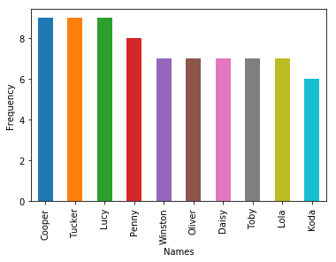
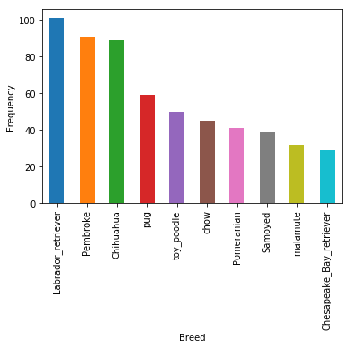
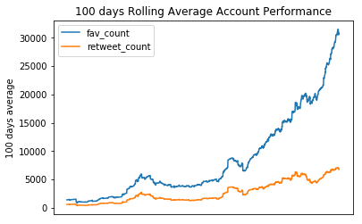

## Warngling process table
### 1. [Gathering Data](#g_data)
### 2. [Assessing Data](#assess)
### 3. [Cleaning Data](#clean)
### 4. [Storing](#store)
### 5. [Data Analysis and Visualizations](#analysis)


```python
import pandas as pd
import requests
import os
import tweepy
import json
import numpy as np
import re
%matplotlib inline
import matplotlib.pyplot as plt
```

## Gathering data 
<a id="g_data"></a>


```python
# read tiwtter archive to df
archive_df = pd.read_csv("twitter-archive-enhanced.csv")


#download images_NL file and open as df

url= "https://d17h27t6h515a5.cloudfront.net/topher/2017/August/599fd2ad_image-predictions/image-predictions.tsv"
r = requests.get(url)

if not os.path.isfile(url.split("/")[-1]):
    with open(url.split("/")[-1], mode="wb") as f:
        f.write(r.content)
image_p_df = pd.read_csv(url.split("/")[-1], sep="\t")


###twitter api#####
'''consumer_key = ''
consumer_secret = ''
access_token = ''
access_secret = ''
auth = tweepy.OAuthHandler(consumer_key, consumer_secret)
auth.set_access_token(access_token, access_secret)
api = tweepy.API(auth, wait_on_rate_limit=True, wait_on_rate_limit_notify=True)
'''
#################

#import data from tweet-json file to df that consists of favorit_count&retweet_count&tweet id 

rt=[]
favb=[]
i_d=[]

with open("tweet-json","r") as file:
    
    for l in file:
        to_dic = json.loads(l)
        rt.append(to_dic['retweet_count'])
        favb.append(to_dic['favorite_count'])
        i_d.append(to_dic['id'])
        
        

json_df =pd.DataFrame({
    "tweet_id":i_d,
    "retweet_count":rt,
    "fav_count":favb
})
```

## Assessing data
<a id="assess"></a>

## Quality issues
### - `Combleteness`
    - missing(NaN) values in columns (in_reply_to_status_id,in_reply_to_user_id) and breed types
    - missing values in name column that can get it from text
    - tweets with no images
    - datasets have retweets and replys data not only tweets
    
### - `Validity`
    - not valid names (the, a, an, by)
    - there are tweets with out images (expanded_urls and retweet url          are empty)
    - there are retweets in all datasets in this data (
      retweeted_status_id           181 non-null float64
      retweeted_status_user_id      181 non-null float64
      retweeted_status_timestamp    181 non-null object )
      
    - there are replys in all datasets in this data (
      in_reply_to_status_id           78 non-null float64
      in_reply_to_user_id      78 non-null float64 )
    - rating_numenator col doesn't match with rate in text (ex: index 47) and there is outliers
    - denominator not equal 10 (ex: index 435)

### - `Accuracy`
    - name values don't match with names in text
    - rating_numenator col doesn't match with rate in text (ex: index 47) and there is outliers
    - source column is an HTML tag


### - `Consistency`
    -	tweet_id dtype is int
    -	unused columns like (denominator, expanded_urls, retweeted_status_id, retweeted_status_user_id, in_reply_to_status_id, in_reply_to_user_id) 
    -	unused columns like img_num and p_n_prediction in image_p df

    

      
      
## - Tideness issues

    - values are column names in archive_df (ex: doggo, floofer, pupper, puppo  should be combined into a single column as this is one variable that identify type of dog)

    - values are column names in image_p_df (ex: p1, p1_dog, p1_conf. p2, p2_dog,p2_conf,p3,p3_dog,p3_conf  all these columns should be in only three columns )

    - Information about one type of observational unit (tweets) is spread across three different DataFrames. So these three DataFrames should be merged as they are part of the same observational unit.

      


```python
archive_df.head()
```


<div>
<style scoped>
    .dataframe tbody tr th:only-of-type {
        vertical-align: middle;
    }

    .dataframe tbody tr th {
        vertical-align: top;
    }

    .dataframe thead th {
        text-align: right;
    }
</style>
<table border="1" class="dataframe">
  <thead>
    <tr style="text-align: right;">
      <th></th>
      <th>tweet_id</th>
      <th>in_reply_to_status_id</th>
      <th>in_reply_to_user_id</th>
      <th>timestamp</th>
      <th>source</th>
      <th>text</th>
      <th>retweeted_status_id</th>
      <th>retweeted_status_user_id</th>
      <th>retweeted_status_timestamp</th>
      <th>expanded_urls</th>
      <th>rating_numerator</th>
      <th>rating_denominator</th>
      <th>name</th>
      <th>doggo</th>
      <th>floofer</th>
      <th>pupper</th>
      <th>puppo</th>
    </tr>
  </thead>
  <tbody>
    <tr>
      <th>0</th>
      <td>892420643555336193</td>
      <td>NaN</td>
      <td>NaN</td>
      <td>2017-08-01 16:23:56 +0000</td>
      <td>&lt;a href="http://twitter.com/download/iphone" r...</td>
      <td>This is Phineas. He's a mystical boy. Only eve...</td>
      <td>NaN</td>
      <td>NaN</td>
      <td>NaN</td>
      <td>https://twitter.com/dog_rates/status/892420643...</td>
      <td>13</td>
      <td>10</td>
      <td>Phineas</td>
      <td>None</td>
      <td>None</td>
      <td>None</td>
      <td>None</td>
    </tr>
    <tr>
      <th>1</th>
      <td>892177421306343426</td>
      <td>NaN</td>
      <td>NaN</td>
      <td>2017-08-01 00:17:27 +0000</td>
      <td>&lt;a href="http://twitter.com/download/iphone" r...</td>
      <td>This is Tilly. She's just checking pup on you....</td>
      <td>NaN</td>
      <td>NaN</td>
      <td>NaN</td>
      <td>https://twitter.com/dog_rates/status/892177421...</td>
      <td>13</td>
      <td>10</td>
      <td>Tilly</td>
      <td>None</td>
      <td>None</td>
      <td>None</td>
      <td>None</td>
    </tr>
    <tr>
      <th>2</th>
      <td>891815181378084864</td>
      <td>NaN</td>
      <td>NaN</td>
      <td>2017-07-31 00:18:03 +0000</td>
      <td>&lt;a href="http://twitter.com/download/iphone" r...</td>
      <td>This is Archie. He is a rare Norwegian Pouncin...</td>
      <td>NaN</td>
      <td>NaN</td>
      <td>NaN</td>
      <td>https://twitter.com/dog_rates/status/891815181...</td>
      <td>12</td>
      <td>10</td>
      <td>Archie</td>
      <td>None</td>
      <td>None</td>
      <td>None</td>
      <td>None</td>
    </tr>
    <tr>
      <th>3</th>
      <td>891689557279858688</td>
      <td>NaN</td>
      <td>NaN</td>
      <td>2017-07-30 15:58:51 +0000</td>
      <td>&lt;a href="http://twitter.com/download/iphone" r...</td>
      <td>This is Darla. She commenced a snooze mid meal...</td>
      <td>NaN</td>
      <td>NaN</td>
      <td>NaN</td>
      <td>https://twitter.com/dog_rates/status/891689557...</td>
      <td>13</td>
      <td>10</td>
      <td>Darla</td>
      <td>None</td>
      <td>None</td>
      <td>None</td>
      <td>None</td>
    </tr>
    <tr>
      <th>4</th>
      <td>891327558926688256</td>
      <td>NaN</td>
      <td>NaN</td>
      <td>2017-07-29 16:00:24 +0000</td>
      <td>&lt;a href="http://twitter.com/download/iphone" r...</td>
      <td>This is Franklin. He would like you to stop ca...</td>
      <td>NaN</td>
      <td>NaN</td>
      <td>NaN</td>
      <td>https://twitter.com/dog_rates/status/891327558...</td>
      <td>12</td>
      <td>10</td>
      <td>Franklin</td>
      <td>None</td>
      <td>None</td>
      <td>None</td>
      <td>None</td>
    </tr>
  </tbody>
</table>
</div>


```python
#tweets that have no images
archive_df[archive_df["expanded_urls"].isna()].head()
```


<div>
<style scoped>
    .dataframe tbody tr th:only-of-type {
        vertical-align: middle;
    }

    .dataframe tbody tr th {
        vertical-align: top;
    }

    .dataframe thead th {
        text-align: right;
    }
</style>
<table border="1" class="dataframe">
  <thead>
    <tr style="text-align: right;">
      <th></th>
      <th>tweet_id</th>
      <th>in_reply_to_status_id</th>
      <th>in_reply_to_user_id</th>
      <th>timestamp</th>
      <th>source</th>
      <th>text</th>
      <th>retweeted_status_id</th>
      <th>retweeted_status_user_id</th>
      <th>retweeted_status_timestamp</th>
      <th>expanded_urls</th>
      <th>rating_numerator</th>
      <th>rating_denominator</th>
      <th>name</th>
      <th>doggo</th>
      <th>floofer</th>
      <th>pupper</th>
      <th>puppo</th>
    </tr>
  </thead>
  <tbody>
    <tr>
      <th>30</th>
      <td>886267009285017600</td>
      <td>8.862664e+17</td>
      <td>2.281182e+09</td>
      <td>2017-07-15 16:51:35 +0000</td>
      <td>&lt;a href="http://twitter.com/download/iphone" r...</td>
      <td>@NonWhiteHat @MayhewMayhem omg hello tanner yo...</td>
      <td>NaN</td>
      <td>NaN</td>
      <td>NaN</td>
      <td>NaN</td>
      <td>12</td>
      <td>10</td>
      <td>None</td>
      <td>None</td>
      <td>None</td>
      <td>None</td>
      <td>None</td>
    </tr>
    <tr>
      <th>55</th>
      <td>881633300179243008</td>
      <td>8.816070e+17</td>
      <td>4.738443e+07</td>
      <td>2017-07-02 21:58:53 +0000</td>
      <td>&lt;a href="http://twitter.com/download/iphone" r...</td>
      <td>@roushfenway These are good dogs but 17/10 is ...</td>
      <td>NaN</td>
      <td>NaN</td>
      <td>NaN</td>
      <td>NaN</td>
      <td>17</td>
      <td>10</td>
      <td>None</td>
      <td>None</td>
      <td>None</td>
      <td>None</td>
      <td>None</td>
    </tr>
    <tr>
      <th>64</th>
      <td>879674319642796034</td>
      <td>8.795538e+17</td>
      <td>3.105441e+09</td>
      <td>2017-06-27 12:14:36 +0000</td>
      <td>&lt;a href="http://twitter.com/download/iphone" r...</td>
      <td>@RealKentMurphy 14/10 confirmed</td>
      <td>NaN</td>
      <td>NaN</td>
      <td>NaN</td>
      <td>NaN</td>
      <td>14</td>
      <td>10</td>
      <td>None</td>
      <td>None</td>
      <td>None</td>
      <td>None</td>
      <td>None</td>
    </tr>
    <tr>
      <th>113</th>
      <td>870726314365509632</td>
      <td>8.707262e+17</td>
      <td>1.648776e+07</td>
      <td>2017-06-02 19:38:25 +0000</td>
      <td>&lt;a href="http://twitter.com/download/iphone" r...</td>
      <td>@ComplicitOwl @ShopWeRateDogs &amp;gt;10/10 is res...</td>
      <td>NaN</td>
      <td>NaN</td>
      <td>NaN</td>
      <td>NaN</td>
      <td>10</td>
      <td>10</td>
      <td>None</td>
      <td>None</td>
      <td>None</td>
      <td>None</td>
      <td>None</td>
    </tr>
    <tr>
      <th>148</th>
      <td>863427515083354112</td>
      <td>8.634256e+17</td>
      <td>7.759620e+07</td>
      <td>2017-05-13 16:15:35 +0000</td>
      <td>&lt;a href="http://twitter.com/download/iphone" r...</td>
      <td>@Jack_Septic_Eye I'd need a few more pics to p...</td>
      <td>NaN</td>
      <td>NaN</td>
      <td>NaN</td>
      <td>NaN</td>
      <td>12</td>
      <td>10</td>
      <td>None</td>
      <td>None</td>
      <td>None</td>
      <td>None</td>
      <td>None</td>
    </tr>
  </tbody>
</table>
</div>


```python
archive_df.info()
```

    <class 'pandas.core.frame.DataFrame'>
    RangeIndex: 2356 entries, 0 to 2355
    Data columns (total 17 columns):
    tweet_id                      2356 non-null int64
    in_reply_to_status_id         78 non-null float64
    in_reply_to_user_id           78 non-null float64
    timestamp                     2356 non-null object
    source                        2356 non-null object
    text                          2356 non-null object
    retweeted_status_id           181 non-null float64
    retweeted_status_user_id      181 non-null float64
    retweeted_status_timestamp    181 non-null object
    expanded_urls                 2297 non-null object
    rating_numerator              2356 non-null int64
    rating_denominator            2356 non-null int64
    name                          2356 non-null object
    doggo                         2356 non-null object
    floofer                       2356 non-null object
    pupper                        2356 non-null object
    puppo                         2356 non-null object
    dtypes: float64(4), int64(3), object(10)
    memory usage: 313.0+ KB
    


```python
image_p_df.head()
```


<div>
<style scoped>
    .dataframe tbody tr th:only-of-type {
        vertical-align: middle;
    }

    .dataframe tbody tr th {
        vertical-align: top;
    }

    .dataframe thead th {
        text-align: right;
    }
</style>
<table border="1" class="dataframe">
  <thead>
    <tr style="text-align: right;">
      <th></th>
      <th>tweet_id</th>
      <th>jpg_url</th>
      <th>img_num</th>
      <th>p1</th>
      <th>p1_conf</th>
      <th>p1_dog</th>
      <th>p2</th>
      <th>p2_conf</th>
      <th>p2_dog</th>
      <th>p3</th>
      <th>p3_conf</th>
      <th>p3_dog</th>
    </tr>
  </thead>
  <tbody>
    <tr>
      <th>0</th>
      <td>666020888022790149</td>
      <td>https://pbs.twimg.com/media/CT4udn0WwAA0aMy.jpg</td>
      <td>1</td>
      <td>Welsh_springer_spaniel</td>
      <td>0.465074</td>
      <td>True</td>
      <td>collie</td>
      <td>0.156665</td>
      <td>True</td>
      <td>Shetland_sheepdog</td>
      <td>0.061428</td>
      <td>True</td>
    </tr>
    <tr>
      <th>1</th>
      <td>666029285002620928</td>
      <td>https://pbs.twimg.com/media/CT42GRgUYAA5iDo.jpg</td>
      <td>1</td>
      <td>redbone</td>
      <td>0.506826</td>
      <td>True</td>
      <td>miniature_pinscher</td>
      <td>0.074192</td>
      <td>True</td>
      <td>Rhodesian_ridgeback</td>
      <td>0.072010</td>
      <td>True</td>
    </tr>
    <tr>
      <th>2</th>
      <td>666033412701032449</td>
      <td>https://pbs.twimg.com/media/CT4521TWwAEvMyu.jpg</td>
      <td>1</td>
      <td>German_shepherd</td>
      <td>0.596461</td>
      <td>True</td>
      <td>malinois</td>
      <td>0.138584</td>
      <td>True</td>
      <td>bloodhound</td>
      <td>0.116197</td>
      <td>True</td>
    </tr>
    <tr>
      <th>3</th>
      <td>666044226329800704</td>
      <td>https://pbs.twimg.com/media/CT5Dr8HUEAA-lEu.jpg</td>
      <td>1</td>
      <td>Rhodesian_ridgeback</td>
      <td>0.408143</td>
      <td>True</td>
      <td>redbone</td>
      <td>0.360687</td>
      <td>True</td>
      <td>miniature_pinscher</td>
      <td>0.222752</td>
      <td>True</td>
    </tr>
    <tr>
      <th>4</th>
      <td>666049248165822465</td>
      <td>https://pbs.twimg.com/media/CT5IQmsXIAAKY4A.jpg</td>
      <td>1</td>
      <td>miniature_pinscher</td>
      <td>0.560311</td>
      <td>True</td>
      <td>Rottweiler</td>
      <td>0.243682</td>
      <td>True</td>
      <td>Doberman</td>
      <td>0.154629</td>
      <td>True</td>
    </tr>
  </tbody>
</table>
</div>


```python
image_p_df.info()
```

    <class 'pandas.core.frame.DataFrame'>
    RangeIndex: 2075 entries, 0 to 2074
    Data columns (total 12 columns):
    tweet_id    2075 non-null int64
    jpg_url     2075 non-null object
    img_num     2075 non-null int64
    p1          2075 non-null object
    p1_conf     2075 non-null float64
    p1_dog      2075 non-null bool
    p2          2075 non-null object
    p2_conf     2075 non-null float64
    p2_dog      2075 non-null bool
    p3          2075 non-null object
    p3_conf     2075 non-null float64
    p3_dog      2075 non-null bool
    dtypes: bool(3), float64(3), int64(2), object(4)
    memory usage: 152.1+ KB
    


```python
json_df.head()
```


<div>
<style scoped>
    .dataframe tbody tr th:only-of-type {
        vertical-align: middle;
    }

    .dataframe tbody tr th {
        vertical-align: top;
    }

    .dataframe thead th {
        text-align: right;
    }
</style>
<table border="1" class="dataframe">
  <thead>
    <tr style="text-align: right;">
      <th></th>
      <th>tweet_id</th>
      <th>retweet_count</th>
      <th>fav_count</th>
    </tr>
  </thead>
  <tbody>
    <tr>
      <th>0</th>
      <td>892420643555336193</td>
      <td>8853</td>
      <td>39467</td>
    </tr>
    <tr>
      <th>1</th>
      <td>892177421306343426</td>
      <td>6514</td>
      <td>33819</td>
    </tr>
    <tr>
      <th>2</th>
      <td>891815181378084864</td>
      <td>4328</td>
      <td>25461</td>
    </tr>
    <tr>
      <th>3</th>
      <td>891689557279858688</td>
      <td>8964</td>
      <td>42908</td>
    </tr>
    <tr>
      <th>4</th>
      <td>891327558926688256</td>
      <td>9774</td>
      <td>41048</td>
    </tr>
  </tbody>
</table>
</div>


```python
json_df.info()
```

    <class 'pandas.core.frame.DataFrame'>
    RangeIndex: 2354 entries, 0 to 2353
    Data columns (total 3 columns):
    tweet_id         2354 non-null int64
    retweet_count    2354 non-null int64
    fav_count        2354 non-null int64
    dtypes: int64(3)
    memory usage: 55.2 KB
    

## Cleaning data
<a id="clean"></a>

 ### `Define`
 
 - remove retweets, replys and expanded_urls from all datasets
 - drop columns:
     -  expanded_urls,
     -  in_reply_to_status_id,
     -  in_reply_to_user_id,
     -  retweeted_status_timestamp,
     -  retweeted_status_user_id,
     -  retweeted_status_id
     

### `Code`


```python
# copy all datasets
clean_archive = archive_df.copy()
clean_image_p = image_p_df.copy()
clean_json = json_df.copy()


#drop tweets that with no images
clean_archive = clean_archive[~clean_archive["expanded_urls"].isna()]

# creating a list of tweet_ids with images "tweets_with_image" and confirming its length
tweets_with_image = list(clean_image_p.tweet_id.unique())

# Cleaning in action ;)
clean_archive = clean_archive[clean_archive.tweet_id.isin(tweets_with_image)]


#get retweets
retweets_l = clean_archive.retweeted_status_id.notnull()

#drop retweets observations
clean_archive = clean_archive[~retweets_l]

#get replys
replys_l = clean_archive.in_reply_to_status_id.notnull()

#drop replys observations
clean_archive = clean_archive[~replys_l]


# Dropping the retweets and replies ids from the image prediction dataframe
clean_image_p = clean_image_p[~np.logical_not(clean_image_p.tweet_id.isin(list(clean_archive.tweet_id)))]

# Dropping the retweets and replies ids from json dataframe
clean_json = clean_json[~np.logical_not(clean_json.tweet_id.isin(list(clean_archive.tweet_id)))]

#Dropping reply and tweet columns 
clean_archive = clean_archive.drop(['retweeted_status_id','retweeted_status_user_id', 'retweeted_status_timestamp',\
                                   "in_reply_to_status_id","in_reply_to_user_id","expanded_urls"],axis=1)


```


```python

```

### `Test`


```python
clean_archive.head()
```


<div>
<style scoped>
    .dataframe tbody tr th:only-of-type {
        vertical-align: middle;
    }

    .dataframe tbody tr th {
        vertical-align: top;
    }

    .dataframe thead th {
        text-align: right;
    }
</style>
<table border="1" class="dataframe">
  <thead>
    <tr style="text-align: right;">
      <th></th>
      <th>tweet_id</th>
      <th>timestamp</th>
      <th>source</th>
      <th>text</th>
      <th>rating_numerator</th>
      <th>rating_denominator</th>
      <th>name</th>
      <th>doggo</th>
      <th>floofer</th>
      <th>pupper</th>
      <th>puppo</th>
    </tr>
  </thead>
  <tbody>
    <tr>
      <th>0</th>
      <td>892420643555336193</td>
      <td>2017-08-01 16:23:56 +0000</td>
      <td>&lt;a href="http://twitter.com/download/iphone" r...</td>
      <td>This is Phineas. He's a mystical boy. Only eve...</td>
      <td>13</td>
      <td>10</td>
      <td>Phineas</td>
      <td>None</td>
      <td>None</td>
      <td>None</td>
      <td>None</td>
    </tr>
    <tr>
      <th>1</th>
      <td>892177421306343426</td>
      <td>2017-08-01 00:17:27 +0000</td>
      <td>&lt;a href="http://twitter.com/download/iphone" r...</td>
      <td>This is Tilly. She's just checking pup on you....</td>
      <td>13</td>
      <td>10</td>
      <td>Tilly</td>
      <td>None</td>
      <td>None</td>
      <td>None</td>
      <td>None</td>
    </tr>
    <tr>
      <th>2</th>
      <td>891815181378084864</td>
      <td>2017-07-31 00:18:03 +0000</td>
      <td>&lt;a href="http://twitter.com/download/iphone" r...</td>
      <td>This is Archie. He is a rare Norwegian Pouncin...</td>
      <td>12</td>
      <td>10</td>
      <td>Archie</td>
      <td>None</td>
      <td>None</td>
      <td>None</td>
      <td>None</td>
    </tr>
    <tr>
      <th>3</th>
      <td>891689557279858688</td>
      <td>2017-07-30 15:58:51 +0000</td>
      <td>&lt;a href="http://twitter.com/download/iphone" r...</td>
      <td>This is Darla. She commenced a snooze mid meal...</td>
      <td>13</td>
      <td>10</td>
      <td>Darla</td>
      <td>None</td>
      <td>None</td>
      <td>None</td>
      <td>None</td>
    </tr>
    <tr>
      <th>4</th>
      <td>891327558926688256</td>
      <td>2017-07-29 16:00:24 +0000</td>
      <td>&lt;a href="http://twitter.com/download/iphone" r...</td>
      <td>This is Franklin. He would like you to stop ca...</td>
      <td>12</td>
      <td>10</td>
      <td>Franklin</td>
      <td>None</td>
      <td>None</td>
      <td>None</td>
      <td>None</td>
    </tr>
  </tbody>
</table>
</div>


### `Define`
- fix breeds' name by making one new col and drop remain 4 cols


### `Code`


```python
# select the dog stages columns from the dataset
breeds = ['doggo', 'pupper', 'puppo', 'floofer']
# replace the 'None' string with np.nan 
for i in breeds:
    if i in clean_archive.columns:
        clean_archive[breeds] = clean_archive[breeds].replace('None', np.nan)

        # create the type column with joining the four columns in one column dog_stage join for more than stage
        clean_archive['type'] = clean_archive[breeds].apply(lambda x: ', '.join(x.dropna().astype('str')),axis =1)
        # replace the empty string with nan and change datatype to category
        clean_archive.type = clean_archive.type.replace('', np.nan)

        # drop the 4 columns

        clean_archive = clean_archive.drop(columns = breeds, axis =1)
clean_archive.loc[200, "type"] = "floofer"
clean_archive.loc[clean_archive[clean_archive.type == "doggo, puppo"].index,"type"] = "puppo"

```

### `Test`


```python
clean_archive.type.value_counts()
```


    pupper           201
    doggo             63
    puppo             23
    floofer            8
    doggo, pupper      8
    Name: type, dtype: int64


### `Define`
#### change name col values
    - get untitled names in clean_archive df then assign that name to "NaN"
    - get lower names in clean_archive df then assign that name to "NaN"

### `code`


```python
# get untitled an lower names from archive df 
untitled = clean_archive.name.loc[clean_archive.name.str.istitle() == False].unique()
lowers = clean_archive.name.loc[clean_archive.name.str.islower()].unique()

l = np.concatenate((untitled,lowers),axis=0)
l = np.unique(l).tolist()[5:]
clean_archive.loc[clean_archive.name.apply(lambda x: x in l), "name"] = np.nan
clean_archive.loc[clean_archive[clean_archive.name == "None"].index,"name"] = np.nan

```

### `Test`


```python
clean_archive.sample()
```


<div>
<style scoped>
    .dataframe tbody tr th:only-of-type {
        vertical-align: middle;
    }

    .dataframe tbody tr th {
        vertical-align: top;
    }

    .dataframe thead th {
        text-align: right;
    }
</style>
<table border="1" class="dataframe">
  <thead>
    <tr style="text-align: right;">
      <th></th>
      <th>tweet_id</th>
      <th>timestamp</th>
      <th>source</th>
      <th>text</th>
      <th>rating_numerator</th>
      <th>rating_denominator</th>
      <th>name</th>
      <th>type</th>
    </tr>
  </thead>
  <tbody>
    <tr>
      <th>2172</th>
      <td>669327207240699904</td>
      <td>2015-11-25 01:30:16 +0000</td>
      <td>&lt;a href="http://twitter.com/download/iphone" r...</td>
      <td>Just got home from college. Dis my dog. She do...</td>
      <td>13</td>
      <td>10</td>
      <td>NaN</td>
      <td>NaN</td>
    </tr>
  </tbody>
</table>
</div>


### Define
- extract name from text


### `Code`


```python
clean_archive["name"] = clean_archive.text.str.extract('((This is|Meet) ([A-Z][a-z]*)\\.)', expand=True)[2]

```

### `Test`


```python
clean_archive.sample(5)
```


<div>
<style scoped>
    .dataframe tbody tr th:only-of-type {
        vertical-align: middle;
    }

    .dataframe tbody tr th {
        vertical-align: top;
    }

    .dataframe thead th {
        text-align: right;
    }
</style>
<table border="1" class="dataframe">
  <thead>
    <tr style="text-align: right;">
      <th></th>
      <th>tweet_id</th>
      <th>timestamp</th>
      <th>source</th>
      <th>text</th>
      <th>rating_numerator</th>
      <th>rating_denominator</th>
      <th>name</th>
      <th>type</th>
    </tr>
  </thead>
  <tbody>
    <tr>
      <th>1748</th>
      <td>679062614270468097</td>
      <td>2015-12-21 22:15:18 +0000</td>
      <td>&lt;a href="http://twitter.com/download/iphone" r...</td>
      <td>This is Chompsky. He lives up to his name. 11/...</td>
      <td>11</td>
      <td>10</td>
      <td>Chompsky</td>
      <td>NaN</td>
    </tr>
    <tr>
      <th>2053</th>
      <td>671485057807351808</td>
      <td>2015-12-01 00:24:48 +0000</td>
      <td>&lt;a href="http://twitter.com/download/iphone" r...</td>
      <td>Meet Penelope. She is a white Macadamias Duode...</td>
      <td>11</td>
      <td>10</td>
      <td>Penelope</td>
      <td>NaN</td>
    </tr>
    <tr>
      <th>797</th>
      <td>773191612633579521</td>
      <td>2016-09-06 16:10:20 +0000</td>
      <td>&lt;a href="http://twitter.com/download/iphone" r...</td>
      <td>This is Grey. He's the dogtor in charge of you...</td>
      <td>12</td>
      <td>10</td>
      <td>Grey</td>
      <td>NaN</td>
    </tr>
    <tr>
      <th>1500</th>
      <td>692158366030913536</td>
      <td>2016-01-27 01:33:08 +0000</td>
      <td>&lt;a href="http://twitter.com/download/iphone" r...</td>
      <td>This is Edgar. He's a Sassafras Puggleflash. N...</td>
      <td>10</td>
      <td>10</td>
      <td>Edgar</td>
      <td>NaN</td>
    </tr>
    <tr>
      <th>76</th>
      <td>878057613040115712</td>
      <td>2017-06-23 01:10:23 +0000</td>
      <td>&lt;a href="http://twitter.com/download/iphone" r...</td>
      <td>This is Emmy. She was adopted today. Massive r...</td>
      <td>14</td>
      <td>10</td>
      <td>Emmy</td>
      <td>NaN</td>
    </tr>
  </tbody>
</table>
</div>


```python
clean_archive.info()
```

    <class 'pandas.core.frame.DataFrame'>
    Int64Index: 1971 entries, 0 to 2355
    Data columns (total 8 columns):
    tweet_id              1971 non-null int64
    timestamp             1971 non-null object
    source                1971 non-null object
    text                  1971 non-null object
    rating_numerator      1971 non-null int64
    rating_denominator    1971 non-null int64
    name                  1178 non-null object
    type                  303 non-null object
    dtypes: int64(3), object(5)
    memory usage: 218.6+ KB
    

### `Define`
- extract rating_numerator and rating_denominator if a rating_denominator is more than 10
- deal with rate

### `Code`


```python
# get indexes and extract dog rate from text that its rating_numerator is more than 20 which should be have more than
# one dog
rate = clean_archive[clean_archive["rating_numerator"] > 20 ].text.str.extract('(\d+[.]{1}\d+[/]\d+|(\d+[/]\d+))')[0].tolist()
de = clean_archive[clean_archive["rating_numerator"] > 20 ].text.str.extract('(\d+[.]{1}\d+[/]\d+|(\d+[/]\d+))')[0].index
```


```python
# only fix index 1068 manually
clean_archive.loc[1068, "rating_numerator"] = 14
clean_archive.loc[1068, "rating_denominator"] = 10

# change dtype of rating_denominator and rating_numerator
clean_archive.rating_numerator = clean_archive.rating_numerator.astype("float64")
clean_archive.rating_denominator = clean_archive.rating_denominator.astype("float64")
clean_archive.rating_numerator.loc[1068]

# set all rating_denominator values to 10
clean_archive.rating_denominator = 10

# fix indexes values from previous list de
for i,j in zip(de, rate):
    if clean_archive.loc[i, "rating_numerator"] >10:
        clean_archive.loc[i, "rating_numerator"] = round(( float(j.split('/')[0]) / ( float(j.split('/')[1]) / 10)), 1)
    clean_archive.loc[i, "rating_denominator"] = 10.0


```

### `Test`


```python
# test gathered rate
clean_archive.loc[de]
```


<div>
<style scoped>
    .dataframe tbody tr th:only-of-type {
        vertical-align: middle;
    }

    .dataframe tbody tr th {
        vertical-align: top;
    }

    .dataframe thead th {
        text-align: right;
    }
</style>
<table border="1" class="dataframe">
  <thead>
    <tr style="text-align: right;">
      <th></th>
      <th>tweet_id</th>
      <th>timestamp</th>
      <th>source</th>
      <th>text</th>
      <th>rating_numerator</th>
      <th>rating_denominator</th>
      <th>name</th>
      <th>type</th>
    </tr>
  </thead>
  <tbody>
    <tr>
      <th>433</th>
      <td>820690176645140481</td>
      <td>2017-01-15 17:52:40 +0000</td>
      <td>&lt;a href="http://twitter.com/download/iphone" r...</td>
      <td>The floofs have been released I repeat the flo...</td>
      <td>12.0</td>
      <td>10.0</td>
      <td>NaN</td>
      <td>NaN</td>
    </tr>
    <tr>
      <th>516</th>
      <td>810984652412424192</td>
      <td>2016-12-19 23:06:23 +0000</td>
      <td>&lt;a href="http://twitter.com/download/iphone" r...</td>
      <td>Meet Sam. She smiles 24/7 &amp;amp; secretly aspir...</td>
      <td>34.3</td>
      <td>10.0</td>
      <td>Sam</td>
      <td>NaN</td>
    </tr>
    <tr>
      <th>695</th>
      <td>786709082849828864</td>
      <td>2016-10-13 23:23:56 +0000</td>
      <td>&lt;a href="http://twitter.com/download/iphone" r...</td>
      <td>This is Logan, the Chow who lived. He solemnly...</td>
      <td>9.8</td>
      <td>10.0</td>
      <td>NaN</td>
      <td>NaN</td>
    </tr>
    <tr>
      <th>763</th>
      <td>778027034220126208</td>
      <td>2016-09-20 00:24:34 +0000</td>
      <td>&lt;a href="http://twitter.com/download/iphone" r...</td>
      <td>This is Sophie. She's a Jubilant Bush Pupper. ...</td>
      <td>11.3</td>
      <td>10.0</td>
      <td>Sophie</td>
      <td>pupper</td>
    </tr>
    <tr>
      <th>902</th>
      <td>758467244762497024</td>
      <td>2016-07-28 01:00:57 +0000</td>
      <td>&lt;a href="http://twitter.com/download/iphone" r...</td>
      <td>Why does this never happen at my front door......</td>
      <td>11.0</td>
      <td>10.0</td>
      <td>NaN</td>
      <td>NaN</td>
    </tr>
    <tr>
      <th>979</th>
      <td>749981277374128128</td>
      <td>2016-07-04 15:00:45 +0000</td>
      <td>&lt;a href="https://about.twitter.com/products/tw...</td>
      <td>This is Atticus. He's quite simply America af....</td>
      <td>1776.0</td>
      <td>10.0</td>
      <td>Atticus</td>
      <td>NaN</td>
    </tr>
    <tr>
      <th>1120</th>
      <td>731156023742988288</td>
      <td>2016-05-13 16:15:54 +0000</td>
      <td>&lt;a href="http://twitter.com/download/iphone" r...</td>
      <td>Say hello to this unbelievably well behaved sq...</td>
      <td>12.0</td>
      <td>10.0</td>
      <td>NaN</td>
      <td>NaN</td>
    </tr>
    <tr>
      <th>1202</th>
      <td>716439118184652801</td>
      <td>2016-04-03 01:36:11 +0000</td>
      <td>&lt;a href="http://twitter.com/download/iphone" r...</td>
      <td>This is Bluebert. He just saw that both #Final...</td>
      <td>10.0</td>
      <td>10.0</td>
      <td>Bluebert</td>
      <td>NaN</td>
    </tr>
    <tr>
      <th>1228</th>
      <td>713900603437621249</td>
      <td>2016-03-27 01:29:02 +0000</td>
      <td>&lt;a href="http://twitter.com/download/iphone" r...</td>
      <td>Happy Saturday here's 9 puppers on a bench. 99...</td>
      <td>11.0</td>
      <td>10.0</td>
      <td>NaN</td>
      <td>NaN</td>
    </tr>
    <tr>
      <th>1254</th>
      <td>710658690886586372</td>
      <td>2016-03-18 02:46:49 +0000</td>
      <td>&lt;a href="http://twitter.com/download/iphone" r...</td>
      <td>Here's a brigade of puppers. All look very pre...</td>
      <td>10.0</td>
      <td>10.0</td>
      <td>NaN</td>
      <td>NaN</td>
    </tr>
    <tr>
      <th>1274</th>
      <td>709198395643068416</td>
      <td>2016-03-14 02:04:08 +0000</td>
      <td>&lt;a href="http://twitter.com/download/iphone" r...</td>
      <td>From left to right:\nCletus, Jerome, Alejandro...</td>
      <td>9.0</td>
      <td>10.0</td>
      <td>NaN</td>
      <td>NaN</td>
    </tr>
    <tr>
      <th>1351</th>
      <td>704054845121142784</td>
      <td>2016-02-28 21:25:30 +0000</td>
      <td>&lt;a href="http://twitter.com/download/iphone" r...</td>
      <td>Here is a whole flock of puppers.  60/50 I'll ...</td>
      <td>12.0</td>
      <td>10.0</td>
      <td>NaN</td>
      <td>NaN</td>
    </tr>
    <tr>
      <th>1433</th>
      <td>697463031882764288</td>
      <td>2016-02-10 16:51:59 +0000</td>
      <td>&lt;a href="http://twitter.com/download/iphone" r...</td>
      <td>Happy Wednesday here's a bucket of pups. 44/40...</td>
      <td>11.0</td>
      <td>10.0</td>
      <td>NaN</td>
      <td>NaN</td>
    </tr>
    <tr>
      <th>1635</th>
      <td>684222868335505415</td>
      <td>2016-01-05 04:00:18 +0000</td>
      <td>&lt;a href="http://twitter.com/download/iphone" r...</td>
      <td>Someone help the girl is being mugged. Several...</td>
      <td>11.0</td>
      <td>10.0</td>
      <td>NaN</td>
      <td>NaN</td>
    </tr>
    <tr>
      <th>1712</th>
      <td>680494726643068929</td>
      <td>2015-12-25 21:06:00 +0000</td>
      <td>&lt;a href="http://twitter.com/download/iphone" r...</td>
      <td>Here we have uncovered an entire battalion of ...</td>
      <td>11.3</td>
      <td>10.0</td>
      <td>NaN</td>
      <td>NaN</td>
    </tr>
    <tr>
      <th>1779</th>
      <td>677716515794329600</td>
      <td>2015-12-18 05:06:23 +0000</td>
      <td>&lt;a href="http://twitter.com/download/iphone" r...</td>
      <td>IT'S PUPPERGEDDON. Total of 144/120 ...I think...</td>
      <td>12.0</td>
      <td>10.0</td>
      <td>NaN</td>
      <td>NaN</td>
    </tr>
    <tr>
      <th>1843</th>
      <td>675853064436391936</td>
      <td>2015-12-13 01:41:41 +0000</td>
      <td>&lt;a href="http://twitter.com/download/iphone" r...</td>
      <td>Here we have an entire platoon of puppers. Tot...</td>
      <td>11.0</td>
      <td>10.0</td>
      <td>NaN</td>
      <td>NaN</td>
    </tr>
    <tr>
      <th>2074</th>
      <td>670842764863651840</td>
      <td>2015-11-29 05:52:33 +0000</td>
      <td>&lt;a href="http://twitter.com/download/iphone" r...</td>
      <td>After so many requests... here you go.\n\nGood...</td>
      <td>420.0</td>
      <td>10.0</td>
      <td>NaN</td>
      <td>NaN</td>
    </tr>
  </tbody>
</table>
</div>


```python
clean_archive.rating_numerator.value_counts()
```


    12.0      450
    10.0      419
    11.0      397
    13.0      253
    9.0       150
    8.0        95
    7.0        52
    14.0       34
    5.0        33
    6.0        32
    3.0        19
    4.0        16
    2.0         9
    1.0         5
    11.3        2
    9.8         1
    0.0         1
    1776.0      1
    420.0       1
    34.3        1
    Name: rating_numerator, dtype: int64


```python

```


```python
clean_image_p.head()
```


<div>
<style scoped>
    .dataframe tbody tr th:only-of-type {
        vertical-align: middle;
    }

    .dataframe tbody tr th {
        vertical-align: top;
    }

    .dataframe thead th {
        text-align: right;
    }
</style>
<table border="1" class="dataframe">
  <thead>
    <tr style="text-align: right;">
      <th></th>
      <th>tweet_id</th>
      <th>jpg_url</th>
      <th>img_num</th>
      <th>p1</th>
      <th>p1_conf</th>
      <th>p1_dog</th>
      <th>p2</th>
      <th>p2_conf</th>
      <th>p2_dog</th>
      <th>p3</th>
      <th>p3_conf</th>
      <th>p3_dog</th>
    </tr>
  </thead>
  <tbody>
    <tr>
      <th>0</th>
      <td>666020888022790149</td>
      <td>https://pbs.twimg.com/media/CT4udn0WwAA0aMy.jpg</td>
      <td>1</td>
      <td>Welsh_springer_spaniel</td>
      <td>0.465074</td>
      <td>True</td>
      <td>collie</td>
      <td>0.156665</td>
      <td>True</td>
      <td>Shetland_sheepdog</td>
      <td>0.061428</td>
      <td>True</td>
    </tr>
    <tr>
      <th>1</th>
      <td>666029285002620928</td>
      <td>https://pbs.twimg.com/media/CT42GRgUYAA5iDo.jpg</td>
      <td>1</td>
      <td>redbone</td>
      <td>0.506826</td>
      <td>True</td>
      <td>miniature_pinscher</td>
      <td>0.074192</td>
      <td>True</td>
      <td>Rhodesian_ridgeback</td>
      <td>0.072010</td>
      <td>True</td>
    </tr>
    <tr>
      <th>2</th>
      <td>666033412701032449</td>
      <td>https://pbs.twimg.com/media/CT4521TWwAEvMyu.jpg</td>
      <td>1</td>
      <td>German_shepherd</td>
      <td>0.596461</td>
      <td>True</td>
      <td>malinois</td>
      <td>0.138584</td>
      <td>True</td>
      <td>bloodhound</td>
      <td>0.116197</td>
      <td>True</td>
    </tr>
    <tr>
      <th>3</th>
      <td>666044226329800704</td>
      <td>https://pbs.twimg.com/media/CT5Dr8HUEAA-lEu.jpg</td>
      <td>1</td>
      <td>Rhodesian_ridgeback</td>
      <td>0.408143</td>
      <td>True</td>
      <td>redbone</td>
      <td>0.360687</td>
      <td>True</td>
      <td>miniature_pinscher</td>
      <td>0.222752</td>
      <td>True</td>
    </tr>
    <tr>
      <th>4</th>
      <td>666049248165822465</td>
      <td>https://pbs.twimg.com/media/CT5IQmsXIAAKY4A.jpg</td>
      <td>1</td>
      <td>miniature_pinscher</td>
      <td>0.560311</td>
      <td>True</td>
      <td>Rottweiler</td>
      <td>0.243682</td>
      <td>True</td>
      <td>Doberman</td>
      <td>0.154629</td>
      <td>True</td>
    </tr>
  </tbody>
</table>
</div>


### `Define`
- fix source col in clean_archive df

### `Code`


```python
clean_archive.source = clean_archive.source.str.extract(r'(?!for\b)([^>]*([A-Z])\w+)')[0]

```

### `Test`


```python
clean_archive.source.value_counts()
```


    Twitter for iPhone    1932
    Twitter Web Client      28
    TweetDeck               11
    Name: source, dtype: int64


```python

```

### Define 
- rename cols in clean_image_p df

### `Code`


```python
cols = ['tweet_id', 'jpg_url', 'img_num', 
       'prediction_1', 'confidence_1', 'breed_1',
       'prediction_2', 'confidence_2', 'breed_2',
       'prediction_3', 'confidence_3', 'breed_3']
clean_image_p.columns = cols

```

### `Test`


```python
clean_image_p.head()
```


<div>
<style scoped>
    .dataframe tbody tr th:only-of-type {
        vertical-align: middle;
    }

    .dataframe tbody tr th {
        vertical-align: top;
    }

    .dataframe thead th {
        text-align: right;
    }
</style>
<table border="1" class="dataframe">
  <thead>
    <tr style="text-align: right;">
      <th></th>
      <th>tweet_id</th>
      <th>jpg_url</th>
      <th>img_num</th>
      <th>prediction_1</th>
      <th>confidence_1</th>
      <th>breed_1</th>
      <th>prediction_2</th>
      <th>confidence_2</th>
      <th>breed_2</th>
      <th>prediction_3</th>
      <th>confidence_3</th>
      <th>breed_3</th>
    </tr>
  </thead>
  <tbody>
    <tr>
      <th>0</th>
      <td>666020888022790149</td>
      <td>https://pbs.twimg.com/media/CT4udn0WwAA0aMy.jpg</td>
      <td>1</td>
      <td>Welsh_springer_spaniel</td>
      <td>0.465074</td>
      <td>True</td>
      <td>collie</td>
      <td>0.156665</td>
      <td>True</td>
      <td>Shetland_sheepdog</td>
      <td>0.061428</td>
      <td>True</td>
    </tr>
    <tr>
      <th>1</th>
      <td>666029285002620928</td>
      <td>https://pbs.twimg.com/media/CT42GRgUYAA5iDo.jpg</td>
      <td>1</td>
      <td>redbone</td>
      <td>0.506826</td>
      <td>True</td>
      <td>miniature_pinscher</td>
      <td>0.074192</td>
      <td>True</td>
      <td>Rhodesian_ridgeback</td>
      <td>0.072010</td>
      <td>True</td>
    </tr>
    <tr>
      <th>2</th>
      <td>666033412701032449</td>
      <td>https://pbs.twimg.com/media/CT4521TWwAEvMyu.jpg</td>
      <td>1</td>
      <td>German_shepherd</td>
      <td>0.596461</td>
      <td>True</td>
      <td>malinois</td>
      <td>0.138584</td>
      <td>True</td>
      <td>bloodhound</td>
      <td>0.116197</td>
      <td>True</td>
    </tr>
    <tr>
      <th>3</th>
      <td>666044226329800704</td>
      <td>https://pbs.twimg.com/media/CT5Dr8HUEAA-lEu.jpg</td>
      <td>1</td>
      <td>Rhodesian_ridgeback</td>
      <td>0.408143</td>
      <td>True</td>
      <td>redbone</td>
      <td>0.360687</td>
      <td>True</td>
      <td>miniature_pinscher</td>
      <td>0.222752</td>
      <td>True</td>
    </tr>
    <tr>
      <th>4</th>
      <td>666049248165822465</td>
      <td>https://pbs.twimg.com/media/CT5IQmsXIAAKY4A.jpg</td>
      <td>1</td>
      <td>miniature_pinscher</td>
      <td>0.560311</td>
      <td>True</td>
      <td>Rottweiler</td>
      <td>0.243682</td>
      <td>True</td>
      <td>Doberman</td>
      <td>0.154629</td>
      <td>True</td>
    </tr>
  </tbody>
</table>
</div>


### Define 
- get breed name and confidence from clean_image_p df to avoid values in headers issue 

### `Code`


```python
#run one time
conf = []
bree = []
idd = []
tmp = pd.DataFrame()
def get_conf_breed(data):
    
    if data.breed_1:
        conf.append(data.confidence_1)
        bree.append(data.prediction_1)
        idd.append(data.tweet_id)
    
    elif data.breed_2:
        conf.append(data.confidence_2)
        bree.append(data.prediction_2)
        idd.append(data.tweet_id)
    
    elif data.breed_3:
        conf.append(data.confidence_3)
        bree.append(data.prediction_3)
        idd.append(data.tweet_id)
        
    else:
        conf.append(0)
        bree.append(np.nan)
        idd.append(data.tweet_id)


clean_image_p.apply(get_conf_breed, axis=1)
        
tmp["tweet_id"]= idd
tmp["breed"] = bree
tmp["prediction_conf"] = conf


    
   
```

### `Test`


```python
# tmp df is clean data from clean_image_p df predictions
tmp.head()
```


<div>
<style scoped>
    .dataframe tbody tr th:only-of-type {
        vertical-align: middle;
    }

    .dataframe tbody tr th {
        vertical-align: top;
    }

    .dataframe thead th {
        text-align: right;
    }
</style>
<table border="1" class="dataframe">
  <thead>
    <tr style="text-align: right;">
      <th></th>
      <th>tweet_id</th>
      <th>breed</th>
      <th>prediction_conf</th>
    </tr>
  </thead>
  <tbody>
    <tr>
      <th>0</th>
      <td>666020888022790149</td>
      <td>Welsh_springer_spaniel</td>
      <td>0.465074</td>
    </tr>
    <tr>
      <th>1</th>
      <td>666029285002620928</td>
      <td>redbone</td>
      <td>0.506826</td>
    </tr>
    <tr>
      <th>2</th>
      <td>666033412701032449</td>
      <td>German_shepherd</td>
      <td>0.596461</td>
    </tr>
    <tr>
      <th>3</th>
      <td>666044226329800704</td>
      <td>Rhodesian_ridgeback</td>
      <td>0.408143</td>
    </tr>
    <tr>
      <th>4</th>
      <td>666049248165822465</td>
      <td>miniature_pinscher</td>
      <td>0.560311</td>
    </tr>
  </tbody>
</table>
</div>


### Define
- drop unimportant cols in clean_image_p df and merge tmp df instead

### `Code`


```python
clean_image_p = clean_image_p.drop(["prediction_1", "confidence_1", "breed_1","prediction_2", "confidence_2", "breed_2", "prediction_3",\
           "confidence_3", "breed_3"],axis=1)

clean_image_p = pd.merge(clean_image_p,tmp, on="tweet_id")

```

### `Test`


```python
clean_image_p.head()
```


<div>
<style scoped>
    .dataframe tbody tr th:only-of-type {
        vertical-align: middle;
    }

    .dataframe tbody tr th {
        vertical-align: top;
    }

    .dataframe thead th {
        text-align: right;
    }
</style>
<table border="1" class="dataframe">
  <thead>
    <tr style="text-align: right;">
      <th></th>
      <th>tweet_id</th>
      <th>jpg_url</th>
      <th>img_num</th>
      <th>breed</th>
      <th>prediction_conf</th>
    </tr>
  </thead>
  <tbody>
    <tr>
      <th>0</th>
      <td>666020888022790149</td>
      <td>https://pbs.twimg.com/media/CT4udn0WwAA0aMy.jpg</td>
      <td>1</td>
      <td>Welsh_springer_spaniel</td>
      <td>0.465074</td>
    </tr>
    <tr>
      <th>1</th>
      <td>666029285002620928</td>
      <td>https://pbs.twimg.com/media/CT42GRgUYAA5iDo.jpg</td>
      <td>1</td>
      <td>redbone</td>
      <td>0.506826</td>
    </tr>
    <tr>
      <th>2</th>
      <td>666033412701032449</td>
      <td>https://pbs.twimg.com/media/CT4521TWwAEvMyu.jpg</td>
      <td>1</td>
      <td>German_shepherd</td>
      <td>0.596461</td>
    </tr>
    <tr>
      <th>3</th>
      <td>666044226329800704</td>
      <td>https://pbs.twimg.com/media/CT5Dr8HUEAA-lEu.jpg</td>
      <td>1</td>
      <td>Rhodesian_ridgeback</td>
      <td>0.408143</td>
    </tr>
    <tr>
      <th>4</th>
      <td>666049248165822465</td>
      <td>https://pbs.twimg.com/media/CT5IQmsXIAAKY4A.jpg</td>
      <td>1</td>
      <td>miniature_pinscher</td>
      <td>0.560311</td>
    </tr>
  </tbody>
</table>
</div>


### Define 
- merge clean_image_p and clean_json and clean_archive df in twitter_archive_master df

### `Code`


```python
twitter_archive_master = pd.merge(clean_archive, clean_image_p, on="tweet_id")
twitter_archive_master = pd.merge(twitter_archive_master, clean_json, on="tweet_id")

```

### `Test`


```python
twitter_archive_master.head()
```


<div>
<style scoped>
    .dataframe tbody tr th:only-of-type {
        vertical-align: middle;
    }

    .dataframe tbody tr th {
        vertical-align: top;
    }

    .dataframe thead th {
        text-align: right;
    }
</style>
<table border="1" class="dataframe">
  <thead>
    <tr style="text-align: right;">
      <th></th>
      <th>tweet_id</th>
      <th>timestamp</th>
      <th>source</th>
      <th>text</th>
      <th>rating_numerator</th>
      <th>rating_denominator</th>
      <th>name</th>
      <th>type</th>
      <th>jpg_url</th>
      <th>img_num</th>
      <th>breed</th>
      <th>prediction_conf</th>
      <th>retweet_count</th>
      <th>fav_count</th>
    </tr>
  </thead>
  <tbody>
    <tr>
      <th>0</th>
      <td>892420643555336193</td>
      <td>2017-08-01 16:23:56 +0000</td>
      <td>Twitter for iPhone</td>
      <td>This is Phineas. He's a mystical boy. Only eve...</td>
      <td>13.0</td>
      <td>10.0</td>
      <td>Phineas</td>
      <td>NaN</td>
      <td>https://pbs.twimg.com/media/DGKD1-bXoAAIAUK.jpg</td>
      <td>1</td>
      <td>NaN</td>
      <td>0.000000</td>
      <td>8853</td>
      <td>39467</td>
    </tr>
    <tr>
      <th>1</th>
      <td>892177421306343426</td>
      <td>2017-08-01 00:17:27 +0000</td>
      <td>Twitter for iPhone</td>
      <td>This is Tilly. She's just checking pup on you....</td>
      <td>13.0</td>
      <td>10.0</td>
      <td>Tilly</td>
      <td>NaN</td>
      <td>https://pbs.twimg.com/media/DGGmoV4XsAAUL6n.jpg</td>
      <td>1</td>
      <td>Chihuahua</td>
      <td>0.323581</td>
      <td>6514</td>
      <td>33819</td>
    </tr>
    <tr>
      <th>2</th>
      <td>891815181378084864</td>
      <td>2017-07-31 00:18:03 +0000</td>
      <td>Twitter for iPhone</td>
      <td>This is Archie. He is a rare Norwegian Pouncin...</td>
      <td>12.0</td>
      <td>10.0</td>
      <td>Archie</td>
      <td>NaN</td>
      <td>https://pbs.twimg.com/media/DGBdLU1WsAANxJ9.jpg</td>
      <td>1</td>
      <td>Chihuahua</td>
      <td>0.716012</td>
      <td>4328</td>
      <td>25461</td>
    </tr>
    <tr>
      <th>3</th>
      <td>891689557279858688</td>
      <td>2017-07-30 15:58:51 +0000</td>
      <td>Twitter for iPhone</td>
      <td>This is Darla. She commenced a snooze mid meal...</td>
      <td>13.0</td>
      <td>10.0</td>
      <td>Darla</td>
      <td>NaN</td>
      <td>https://pbs.twimg.com/media/DF_q7IAWsAEuuN8.jpg</td>
      <td>1</td>
      <td>Labrador_retriever</td>
      <td>0.168086</td>
      <td>8964</td>
      <td>42908</td>
    </tr>
    <tr>
      <th>4</th>
      <td>891327558926688256</td>
      <td>2017-07-29 16:00:24 +0000</td>
      <td>Twitter for iPhone</td>
      <td>This is Franklin. He would like you to stop ca...</td>
      <td>12.0</td>
      <td>10.0</td>
      <td>Franklin</td>
      <td>NaN</td>
      <td>https://pbs.twimg.com/media/DF6hr6BUMAAzZgT.jpg</td>
      <td>2</td>
      <td>basset</td>
      <td>0.555712</td>
      <td>9774</td>
      <td>41048</td>
    </tr>
  </tbody>
</table>
</div>


### `Define`
- **drop the row that has sentence "We only rate dogs" this tweet's image doesn't include dogs**


### `Code`


```python
twitter_archive_master.drop(\
  twitter_archive_master[twitter_archive_master.text.apply(lambda x: "We only rate dogs" in x)].index,axis=0,inplace=True)
```

### `Test`


```python
#insure that non-dogs tweets is removed
twitter_archive_master[twitter_archive_master.text.apply(lambda x: "We only rate dogs" in x)].index
```


    Int64Index([], dtype='int64')


### Define
- replace None values to Nan in type and name columns

### `Code`


```python
twitter_archive_master.type = twitter_archive_master.type.replace(to_replace = "None", value=np.nan)
twitter_archive_master.name = twitter_archive_master.name.replace(to_replace = "None", value=np.nan)
```

### `Test`


```python
twitter_archive_master.head()
```


<div>
<style scoped>
    .dataframe tbody tr th:only-of-type {
        vertical-align: middle;
    }

    .dataframe tbody tr th {
        vertical-align: top;
    }

    .dataframe thead th {
        text-align: right;
    }
</style>
<table border="1" class="dataframe">
  <thead>
    <tr style="text-align: right;">
      <th></th>
      <th>tweet_id</th>
      <th>timestamp</th>
      <th>source</th>
      <th>text</th>
      <th>rating_numerator</th>
      <th>rating_denominator</th>
      <th>name</th>
      <th>type</th>
      <th>jpg_url</th>
      <th>img_num</th>
      <th>breed</th>
      <th>prediction_conf</th>
      <th>retweet_count</th>
      <th>fav_count</th>
    </tr>
  </thead>
  <tbody>
    <tr>
      <th>0</th>
      <td>892420643555336193</td>
      <td>2017-08-01 16:23:56 +0000</td>
      <td>Twitter for iPhone</td>
      <td>This is Phineas. He's a mystical boy. Only eve...</td>
      <td>13.0</td>
      <td>10.0</td>
      <td>Phineas</td>
      <td>NaN</td>
      <td>https://pbs.twimg.com/media/DGKD1-bXoAAIAUK.jpg</td>
      <td>1</td>
      <td>NaN</td>
      <td>0.000000</td>
      <td>8853</td>
      <td>39467</td>
    </tr>
    <tr>
      <th>1</th>
      <td>892177421306343426</td>
      <td>2017-08-01 00:17:27 +0000</td>
      <td>Twitter for iPhone</td>
      <td>This is Tilly. She's just checking pup on you....</td>
      <td>13.0</td>
      <td>10.0</td>
      <td>Tilly</td>
      <td>NaN</td>
      <td>https://pbs.twimg.com/media/DGGmoV4XsAAUL6n.jpg</td>
      <td>1</td>
      <td>Chihuahua</td>
      <td>0.323581</td>
      <td>6514</td>
      <td>33819</td>
    </tr>
    <tr>
      <th>2</th>
      <td>891815181378084864</td>
      <td>2017-07-31 00:18:03 +0000</td>
      <td>Twitter for iPhone</td>
      <td>This is Archie. He is a rare Norwegian Pouncin...</td>
      <td>12.0</td>
      <td>10.0</td>
      <td>Archie</td>
      <td>NaN</td>
      <td>https://pbs.twimg.com/media/DGBdLU1WsAANxJ9.jpg</td>
      <td>1</td>
      <td>Chihuahua</td>
      <td>0.716012</td>
      <td>4328</td>
      <td>25461</td>
    </tr>
    <tr>
      <th>3</th>
      <td>891689557279858688</td>
      <td>2017-07-30 15:58:51 +0000</td>
      <td>Twitter for iPhone</td>
      <td>This is Darla. She commenced a snooze mid meal...</td>
      <td>13.0</td>
      <td>10.0</td>
      <td>Darla</td>
      <td>NaN</td>
      <td>https://pbs.twimg.com/media/DF_q7IAWsAEuuN8.jpg</td>
      <td>1</td>
      <td>Labrador_retriever</td>
      <td>0.168086</td>
      <td>8964</td>
      <td>42908</td>
    </tr>
    <tr>
      <th>4</th>
      <td>891327558926688256</td>
      <td>2017-07-29 16:00:24 +0000</td>
      <td>Twitter for iPhone</td>
      <td>This is Franklin. He would like you to stop ca...</td>
      <td>12.0</td>
      <td>10.0</td>
      <td>Franklin</td>
      <td>NaN</td>
      <td>https://pbs.twimg.com/media/DF6hr6BUMAAzZgT.jpg</td>
      <td>2</td>
      <td>basset</td>
      <td>0.555712</td>
      <td>9774</td>
      <td>41048</td>
    </tr>
  </tbody>
</table>
</div>


### Define 
- drop rating_denominator col from twitter_archive_master it's a known fixed number
- drop img_num col from twitter_archive_master not needed in analysis

### `Code` 


```python
twitter_archive_master = twitter_archive_master.drop(["rating_denominator","img_num"], axis=1)

```


```python
twitter_archive_master = twitter_archive_master.reset_index()
twitter_archive_master = twitter_archive_master.drop("index",axis=1)
```

### `Test`


```python
twitter_archive_master.sample()
```


<div>
<style scoped>
    .dataframe tbody tr th:only-of-type {
        vertical-align: middle;
    }

    .dataframe tbody tr th {
        vertical-align: top;
    }

    .dataframe thead th {
        text-align: right;
    }
</style>
<table border="1" class="dataframe">
  <thead>
    <tr style="text-align: right;">
      <th></th>
      <th>tweet_id</th>
      <th>timestamp</th>
      <th>source</th>
      <th>text</th>
      <th>rating_numerator</th>
      <th>name</th>
      <th>type</th>
      <th>jpg_url</th>
      <th>breed</th>
      <th>prediction_conf</th>
      <th>retweet_count</th>
      <th>fav_count</th>
    </tr>
  </thead>
  <tbody>
    <tr>
      <th>161</th>
      <td>849412302885593088</td>
      <td>2017-04-05 00:04:08 +0000</td>
      <td>Twitter for iPhone</td>
      <td>This is Noosh. He noticed you were in the show...</td>
      <td>12.0</td>
      <td>Noosh</td>
      <td>NaN</td>
      <td>https://pbs.twimg.com/media/C8m3-iQVoAAETnF.jpg</td>
      <td>schipperke</td>
      <td>0.907559</td>
      <td>3487</td>
      <td>17039</td>
    </tr>
  </tbody>
</table>
</div>


### Define
- remove a row has no name&type&breed & numerator >100 (ex: twitter_archive_master.rating_numerator == 420.0 not a dog)

### `Code`


```python
x = twitter_archive_master.apply(\
lambda x:  (x["rating_numerator"] > 100) & (pd.isnull(x["breed"])) & (pd.isnull(x["name"])) & (pd.isnull(x["type"])),axis=1)

twitter_archive_master.drop(twitter_archive_master[x].index,axis=0, inplace=True)
```

### `Test`


```python
twitter_archive_master.sample(5)
```


<div>
<style scoped>
    .dataframe tbody tr th:only-of-type {
        vertical-align: middle;
    }

    .dataframe tbody tr th {
        vertical-align: top;
    }

    .dataframe thead th {
        text-align: right;
    }
</style>
<table border="1" class="dataframe">
  <thead>
    <tr style="text-align: right;">
      <th></th>
      <th>tweet_id</th>
      <th>timestamp</th>
      <th>source</th>
      <th>text</th>
      <th>rating_numerator</th>
      <th>name</th>
      <th>type</th>
      <th>jpg_url</th>
      <th>breed</th>
      <th>prediction_conf</th>
      <th>retweet_count</th>
      <th>fav_count</th>
    </tr>
  </thead>
  <tbody>
    <tr>
      <th>1207</th>
      <td>686947101016735744</td>
      <td>2016-01-12 16:25:26 +0000</td>
      <td>Twitter for iPhone</td>
      <td>This is Jackson. He was specifically told not ...</td>
      <td>11.0</td>
      <td>Jackson</td>
      <td>NaN</td>
      <td>https://pbs.twimg.com/media/CYiGvn-UwAEe4wL.jpg</td>
      <td>NaN</td>
      <td>0.000000</td>
      <td>3582</td>
      <td>9433</td>
    </tr>
    <tr>
      <th>1047</th>
      <td>699801817392291840</td>
      <td>2016-02-17 03:45:29 +0000</td>
      <td>Twitter for iPhone</td>
      <td>This is Cooper. He began to tear up when his b...</td>
      <td>11.0</td>
      <td>Cooper</td>
      <td>pupper</td>
      <td>https://pbs.twimg.com/media/CbYyCMcWIAAHHjF.jpg</td>
      <td>golden_retriever</td>
      <td>0.808978</td>
      <td>1088</td>
      <td>3345</td>
    </tr>
    <tr>
      <th>1199</th>
      <td>687460506001633280</td>
      <td>2016-01-14 02:25:31 +0000</td>
      <td>Twitter for iPhone</td>
      <td>This is Kramer. He's a Picasso Tortellini. Tie...</td>
      <td>10.0</td>
      <td>Kramer</td>
      <td>NaN</td>
      <td>https://pbs.twimg.com/media/CYpZrtDWwAE8Kpw.jpg</td>
      <td>Boston_bull</td>
      <td>0.223366</td>
      <td>614</td>
      <td>2243</td>
    </tr>
    <tr>
      <th>882</th>
      <td>717009362452090881</td>
      <td>2016-04-04 15:22:08 +0000</td>
      <td>Twitter for iPhone</td>
      <td>This is Smokey. He's having some sort of exist...</td>
      <td>10.0</td>
      <td>Smokey</td>
      <td>pupper</td>
      <td>https://pbs.twimg.com/media/CfNUNetW8AAekHx.jpg</td>
      <td>Siberian_husky</td>
      <td>0.506154</td>
      <td>1102</td>
      <td>3583</td>
    </tr>
    <tr>
      <th>440</th>
      <td>793256262322548741</td>
      <td>2016-11-01 01:00:05 +0000</td>
      <td>Twitter for iPhone</td>
      <td>Oh h*ck look at this spookling right here. Fri...</td>
      <td>12.0</td>
      <td>NaN</td>
      <td>NaN</td>
      <td>https://pbs.twimg.com/media/CwI2XCvXEAEO8mc.jpg</td>
      <td>basset</td>
      <td>0.207622</td>
      <td>9714</td>
      <td>22350</td>
    </tr>
  </tbody>
</table>
</div>


```python

```


```python
# row has no name&type&breed & numerator >100 and not a dog
twitter_archive_master[twitter_archive_master.rating_numerator == 420.0]
```


<div>
<style scoped>
    .dataframe tbody tr th:only-of-type {
        vertical-align: middle;
    }

    .dataframe tbody tr th {
        vertical-align: top;
    }

    .dataframe thead th {
        text-align: right;
    }
</style>
<table border="1" class="dataframe">
  <thead>
    <tr style="text-align: right;">
      <th></th>
      <th>tweet_id</th>
      <th>timestamp</th>
      <th>source</th>
      <th>text</th>
      <th>rating_numerator</th>
      <th>name</th>
      <th>type</th>
      <th>jpg_url</th>
      <th>breed</th>
      <th>prediction_conf</th>
      <th>retweet_count</th>
      <th>fav_count</th>
    </tr>
  </thead>
  <tbody>
  </tbody>
</table>
</div>


### Define 
- change tweet id dtype to 

### `Code`


```python
twitter_archive_master.tweet_id = twitter_archive_master.astype({'tweet_id': 'object'})
```

### `Test`


```python
twitter_archive_master.info()
```

    <class 'pandas.core.frame.DataFrame'>
    Int64Index: 1922 entries, 0 to 1922
    Data columns (total 12 columns):
    tweet_id            1922 non-null object
    timestamp           1922 non-null object
    source              1922 non-null object
    text                1922 non-null object
    rating_numerator    1922 non-null float64
    name                1178 non-null object
    type                303 non-null object
    jpg_url             1922 non-null object
    breed               1622 non-null object
    prediction_conf     1922 non-null float64
    retweet_count       1922 non-null int64
    fav_count           1922 non-null int64
    dtypes: float64(2), int64(2), object(8)
    memory usage: 195.2+ KB
    

### Define
- reset index in twitter_archive_master df

### `Code`


```python
twitter_archive_master = twitter_archive_master.reset_index()
twitter_archive_master = twitter_archive_master.drop("index",axis=1)
```

### `Test`


```python
twitter_archive_master
```


<div>
<style scoped>
    .dataframe tbody tr th:only-of-type {
        vertical-align: middle;
    }

    .dataframe tbody tr th {
        vertical-align: top;
    }

    .dataframe thead th {
        text-align: right;
    }
</style>
<table border="1" class="dataframe">
  <thead>
    <tr style="text-align: right;">
      <th></th>
      <th>tweet_id</th>
      <th>timestamp</th>
      <th>source</th>
      <th>text</th>
      <th>rating_numerator</th>
      <th>name</th>
      <th>type</th>
      <th>jpg_url</th>
      <th>breed</th>
      <th>prediction_conf</th>
      <th>retweet_count</th>
      <th>fav_count</th>
    </tr>
  </thead>
  <tbody>
    <tr>
      <th>0</th>
      <td>892420643555336193</td>
      <td>2017-08-01 16:23:56 +0000</td>
      <td>Twitter for iPhone</td>
      <td>This is Phineas. He's a mystical boy. Only eve...</td>
      <td>13.0</td>
      <td>Phineas</td>
      <td>NaN</td>
      <td>https://pbs.twimg.com/media/DGKD1-bXoAAIAUK.jpg</td>
      <td>NaN</td>
      <td>0.000000</td>
      <td>8853</td>
      <td>39467</td>
    </tr>
    <tr>
      <th>1</th>
      <td>892177421306343426</td>
      <td>2017-08-01 00:17:27 +0000</td>
      <td>Twitter for iPhone</td>
      <td>This is Tilly. She's just checking pup on you....</td>
      <td>13.0</td>
      <td>Tilly</td>
      <td>NaN</td>
      <td>https://pbs.twimg.com/media/DGGmoV4XsAAUL6n.jpg</td>
      <td>Chihuahua</td>
      <td>0.323581</td>
      <td>6514</td>
      <td>33819</td>
    </tr>
    <tr>
      <th>2</th>
      <td>891815181378084864</td>
      <td>2017-07-31 00:18:03 +0000</td>
      <td>Twitter for iPhone</td>
      <td>This is Archie. He is a rare Norwegian Pouncin...</td>
      <td>12.0</td>
      <td>Archie</td>
      <td>NaN</td>
      <td>https://pbs.twimg.com/media/DGBdLU1WsAANxJ9.jpg</td>
      <td>Chihuahua</td>
      <td>0.716012</td>
      <td>4328</td>
      <td>25461</td>
    </tr>
    <tr>
      <th>3</th>
      <td>891689557279858688</td>
      <td>2017-07-30 15:58:51 +0000</td>
      <td>Twitter for iPhone</td>
      <td>This is Darla. She commenced a snooze mid meal...</td>
      <td>13.0</td>
      <td>Darla</td>
      <td>NaN</td>
      <td>https://pbs.twimg.com/media/DF_q7IAWsAEuuN8.jpg</td>
      <td>Labrador_retriever</td>
      <td>0.168086</td>
      <td>8964</td>
      <td>42908</td>
    </tr>
    <tr>
      <th>4</th>
      <td>891327558926688256</td>
      <td>2017-07-29 16:00:24 +0000</td>
      <td>Twitter for iPhone</td>
      <td>This is Franklin. He would like you to stop ca...</td>
      <td>12.0</td>
      <td>Franklin</td>
      <td>NaN</td>
      <td>https://pbs.twimg.com/media/DF6hr6BUMAAzZgT.jpg</td>
      <td>basset</td>
      <td>0.555712</td>
      <td>9774</td>
      <td>41048</td>
    </tr>
    <tr>
      <th>5</th>
      <td>891087950875897856</td>
      <td>2017-07-29 00:08:17 +0000</td>
      <td>Twitter for iPhone</td>
      <td>Here we have a majestic great white breaching ...</td>
      <td>13.0</td>
      <td>NaN</td>
      <td>NaN</td>
      <td>https://pbs.twimg.com/media/DF3HwyEWsAABqE6.jpg</td>
      <td>Chesapeake_Bay_retriever</td>
      <td>0.425595</td>
      <td>3261</td>
      <td>20562</td>
    </tr>
    <tr>
      <th>6</th>
      <td>890971913173991426</td>
      <td>2017-07-28 16:27:12 +0000</td>
      <td>Twitter for iPhone</td>
      <td>Meet Jax. He enjoys ice cream so much he gets ...</td>
      <td>13.0</td>
      <td>Jax</td>
      <td>NaN</td>
      <td>https://pbs.twimg.com/media/DF1eOmZXUAALUcq.jpg</td>
      <td>Appenzeller</td>
      <td>0.341703</td>
      <td>2158</td>
      <td>12041</td>
    </tr>
    <tr>
      <th>7</th>
      <td>890729181411237888</td>
      <td>2017-07-28 00:22:40 +0000</td>
      <td>Twitter for iPhone</td>
      <td>When you watch your owner call another dog a g...</td>
      <td>13.0</td>
      <td>NaN</td>
      <td>NaN</td>
      <td>https://pbs.twimg.com/media/DFyBahAVwAAhUTd.jpg</td>
      <td>Pomeranian</td>
      <td>0.566142</td>
      <td>16716</td>
      <td>56848</td>
    </tr>
    <tr>
      <th>8</th>
      <td>890609185150312448</td>
      <td>2017-07-27 16:25:51 +0000</td>
      <td>Twitter for iPhone</td>
      <td>This is Zoey. She doesn't want to be one of th...</td>
      <td>13.0</td>
      <td>Zoey</td>
      <td>NaN</td>
      <td>https://pbs.twimg.com/media/DFwUU__XcAEpyXI.jpg</td>
      <td>Irish_terrier</td>
      <td>0.487574</td>
      <td>4429</td>
      <td>28226</td>
    </tr>
    <tr>
      <th>9</th>
      <td>890240255349198849</td>
      <td>2017-07-26 15:59:51 +0000</td>
      <td>Twitter for iPhone</td>
      <td>This is Cassie. She is a college pup. Studying...</td>
      <td>14.0</td>
      <td>Cassie</td>
      <td>doggo</td>
      <td>https://pbs.twimg.com/media/DFrEyVuW0AAO3t9.jpg</td>
      <td>Pembroke</td>
      <td>0.511319</td>
      <td>7711</td>
      <td>32467</td>
    </tr>
    <tr>
      <th>10</th>
      <td>890006608113172480</td>
      <td>2017-07-26 00:31:25 +0000</td>
      <td>Twitter for iPhone</td>
      <td>This is Koda. He is a South Australian decksha...</td>
      <td>13.0</td>
      <td>Koda</td>
      <td>NaN</td>
      <td>https://pbs.twimg.com/media/DFnwSY4WAAAMliS.jpg</td>
      <td>Samoyed</td>
      <td>0.957979</td>
      <td>7624</td>
      <td>31166</td>
    </tr>
    <tr>
      <th>11</th>
      <td>889880896479866881</td>
      <td>2017-07-25 16:11:53 +0000</td>
      <td>Twitter for iPhone</td>
      <td>This is Bruno. He is a service shark. Only get...</td>
      <td>13.0</td>
      <td>Bruno</td>
      <td>NaN</td>
      <td>https://pbs.twimg.com/media/DFl99B1WsAITKsg.jpg</td>
      <td>French_bulldog</td>
      <td>0.377417</td>
      <td>5156</td>
      <td>28268</td>
    </tr>
    <tr>
      <th>12</th>
      <td>889665388333682689</td>
      <td>2017-07-25 01:55:32 +0000</td>
      <td>Twitter for iPhone</td>
      <td>Here's a puppo that seems to be on the fence a...</td>
      <td>13.0</td>
      <td>NaN</td>
      <td>puppo</td>
      <td>https://pbs.twimg.com/media/DFi579UWsAAatzw.jpg</td>
      <td>Pembroke</td>
      <td>0.966327</td>
      <td>8538</td>
      <td>38818</td>
    </tr>
    <tr>
      <th>13</th>
      <td>889638837579907072</td>
      <td>2017-07-25 00:10:02 +0000</td>
      <td>Twitter for iPhone</td>
      <td>This is Ted. He does his best. Sometimes that'...</td>
      <td>12.0</td>
      <td>Ted</td>
      <td>NaN</td>
      <td>https://pbs.twimg.com/media/DFihzFfXsAYGDPR.jpg</td>
      <td>French_bulldog</td>
      <td>0.991650</td>
      <td>4735</td>
      <td>27672</td>
    </tr>
    <tr>
      <th>14</th>
      <td>889531135344209921</td>
      <td>2017-07-24 17:02:04 +0000</td>
      <td>Twitter for iPhone</td>
      <td>This is Stuart. He's sporting his favorite fan...</td>
      <td>13.0</td>
      <td>Stuart</td>
      <td>puppo</td>
      <td>https://pbs.twimg.com/media/DFg_2PVW0AEHN3p.jpg</td>
      <td>golden_retriever</td>
      <td>0.953442</td>
      <td>2321</td>
      <td>15359</td>
    </tr>
    <tr>
      <th>15</th>
      <td>889278841981685760</td>
      <td>2017-07-24 00:19:32 +0000</td>
      <td>Twitter for iPhone</td>
      <td>This is Oliver. You're witnessing one of his m...</td>
      <td>13.0</td>
      <td>Oliver</td>
      <td>NaN</td>
      <td>https://pbs.twimg.com/ext_tw_video_thumb/88927...</td>
      <td>whippet</td>
      <td>0.626152</td>
      <td>5637</td>
      <td>25652</td>
    </tr>
    <tr>
      <th>16</th>
      <td>888917238123831296</td>
      <td>2017-07-23 00:22:39 +0000</td>
      <td>Twitter for iPhone</td>
      <td>This is Jim. He found a fren. Taught him how t...</td>
      <td>12.0</td>
      <td>Jim</td>
      <td>NaN</td>
      <td>https://pbs.twimg.com/media/DFYRgsOUQAARGhO.jpg</td>
      <td>golden_retriever</td>
      <td>0.714719</td>
      <td>4709</td>
      <td>29611</td>
    </tr>
    <tr>
      <th>17</th>
      <td>888804989199671297</td>
      <td>2017-07-22 16:56:37 +0000</td>
      <td>Twitter for iPhone</td>
      <td>This is Zeke. He has a new stick. Very proud o...</td>
      <td>13.0</td>
      <td>Zeke</td>
      <td>NaN</td>
      <td>https://pbs.twimg.com/media/DFWra-3VYAA2piG.jpg</td>
      <td>golden_retriever</td>
      <td>0.469760</td>
      <td>4559</td>
      <td>26080</td>
    </tr>
    <tr>
      <th>18</th>
      <td>888554962724278272</td>
      <td>2017-07-22 00:23:06 +0000</td>
      <td>Twitter for iPhone</td>
      <td>This is Ralphus. He's powering up. Attempting ...</td>
      <td>13.0</td>
      <td>Ralphus</td>
      <td>NaN</td>
      <td>https://pbs.twimg.com/media/DFTH_O-UQAACu20.jpg</td>
      <td>Siberian_husky</td>
      <td>0.700377</td>
      <td>3732</td>
      <td>20290</td>
    </tr>
    <tr>
      <th>19</th>
      <td>888078434458587136</td>
      <td>2017-07-20 16:49:33 +0000</td>
      <td>Twitter for iPhone</td>
      <td>This is Gerald. He was just told he didn't get...</td>
      <td>12.0</td>
      <td>Gerald</td>
      <td>NaN</td>
      <td>https://pbs.twimg.com/media/DFMWn56WsAAkA7B.jpg</td>
      <td>French_bulldog</td>
      <td>0.995026</td>
      <td>3653</td>
      <td>22201</td>
    </tr>
    <tr>
      <th>20</th>
      <td>887705289381826560</td>
      <td>2017-07-19 16:06:48 +0000</td>
      <td>Twitter for iPhone</td>
      <td>This is Jeffrey. He has a monopoly on the pool...</td>
      <td>13.0</td>
      <td>Jeffrey</td>
      <td>NaN</td>
      <td>https://pbs.twimg.com/media/DFHDQBbXgAEqY7t.jpg</td>
      <td>basset</td>
      <td>0.821664</td>
      <td>5609</td>
      <td>30779</td>
    </tr>
    <tr>
      <th>21</th>
      <td>887517139158093824</td>
      <td>2017-07-19 03:39:09 +0000</td>
      <td>Twitter for iPhone</td>
      <td>I've yet to rate a Venezuelan Hover Wiener. Th...</td>
      <td>14.0</td>
      <td>NaN</td>
      <td>NaN</td>
      <td>https://pbs.twimg.com/ext_tw_video_thumb/88751...</td>
      <td>NaN</td>
      <td>0.000000</td>
      <td>12082</td>
      <td>46959</td>
    </tr>
    <tr>
      <th>22</th>
      <td>887473957103951883</td>
      <td>2017-07-19 00:47:34 +0000</td>
      <td>Twitter for iPhone</td>
      <td>This is Canela. She attempted some fancy porch...</td>
      <td>13.0</td>
      <td>Canela</td>
      <td>NaN</td>
      <td>https://pbs.twimg.com/media/DFDw2tyUQAAAFke.jpg</td>
      <td>Pembroke</td>
      <td>0.809197</td>
      <td>18781</td>
      <td>69871</td>
    </tr>
    <tr>
      <th>23</th>
      <td>887343217045368832</td>
      <td>2017-07-18 16:08:03 +0000</td>
      <td>Twitter for iPhone</td>
      <td>You may not have known you needed to see this ...</td>
      <td>13.0</td>
      <td>NaN</td>
      <td>NaN</td>
      <td>https://pbs.twimg.com/ext_tw_video_thumb/88734...</td>
      <td>Mexican_hairless</td>
      <td>0.330741</td>
      <td>10737</td>
      <td>34222</td>
    </tr>
    <tr>
      <th>24</th>
      <td>886983233522544640</td>
      <td>2017-07-17 16:17:36 +0000</td>
      <td>Twitter for iPhone</td>
      <td>This is Maya. She's very shy. Rarely leaves he...</td>
      <td>13.0</td>
      <td>Maya</td>
      <td>NaN</td>
      <td>https://pbs.twimg.com/media/DE8yicJW0AAAvBJ.jpg</td>
      <td>Chihuahua</td>
      <td>0.793469</td>
      <td>8084</td>
      <td>35859</td>
    </tr>
    <tr>
      <th>25</th>
      <td>886736880519319552</td>
      <td>2017-07-16 23:58:41 +0000</td>
      <td>Twitter for iPhone</td>
      <td>This is Mingus. He's a wonderful father to his...</td>
      <td>13.0</td>
      <td>Mingus</td>
      <td>NaN</td>
      <td>https://pbs.twimg.com/media/DE5Se8FXcAAJFx4.jpg</td>
      <td>kuvasz</td>
      <td>0.309706</td>
      <td>3443</td>
      <td>12306</td>
    </tr>
    <tr>
      <th>26</th>
      <td>886680336477933568</td>
      <td>2017-07-16 20:14:00 +0000</td>
      <td>Twitter for iPhone</td>
      <td>This is Derek. He's late for a dog meeting. 13...</td>
      <td>13.0</td>
      <td>Derek</td>
      <td>NaN</td>
      <td>https://pbs.twimg.com/media/DE4fEDzWAAAyHMM.jpg</td>
      <td>NaN</td>
      <td>0.000000</td>
      <td>4610</td>
      <td>22798</td>
    </tr>
    <tr>
      <th>27</th>
      <td>886366144734445568</td>
      <td>2017-07-15 23:25:31 +0000</td>
      <td>Twitter for iPhone</td>
      <td>This is Roscoe. Another pupper fallen victim t...</td>
      <td>12.0</td>
      <td>Roscoe</td>
      <td>pupper</td>
      <td>https://pbs.twimg.com/media/DE0BTnQUwAApKEH.jpg</td>
      <td>French_bulldog</td>
      <td>0.999201</td>
      <td>3316</td>
      <td>21524</td>
    </tr>
    <tr>
      <th>28</th>
      <td>886258384151887873</td>
      <td>2017-07-15 16:17:19 +0000</td>
      <td>Twitter for iPhone</td>
      <td>This is Waffles. His doggles are pupside down....</td>
      <td>13.0</td>
      <td>Waffles</td>
      <td>NaN</td>
      <td>https://pbs.twimg.com/media/DEyfTG4UMAE4aE9.jpg</td>
      <td>pug</td>
      <td>0.943575</td>
      <td>6523</td>
      <td>28469</td>
    </tr>
    <tr>
      <th>29</th>
      <td>885984800019947520</td>
      <td>2017-07-14 22:10:11 +0000</td>
      <td>Twitter for iPhone</td>
      <td>Viewer discretion advised. This is Jimbo. He w...</td>
      <td>12.0</td>
      <td>Jimbo</td>
      <td>NaN</td>
      <td>https://pbs.twimg.com/media/DEumeWWV0AA-Z61.jpg</td>
      <td>Blenheim_spaniel</td>
      <td>0.972494</td>
      <td>7097</td>
      <td>33382</td>
    </tr>
    <tr>
      <th>...</th>
      <td>...</td>
      <td>...</td>
      <td>...</td>
      <td>...</td>
      <td>...</td>
      <td>...</td>
      <td>...</td>
      <td>...</td>
      <td>...</td>
      <td>...</td>
      <td>...</td>
      <td>...</td>
    </tr>
    <tr>
      <th>1892</th>
      <td>666411507551481857</td>
      <td>2015-11-17 00:24:19 +0000</td>
      <td>Twitter for iPhone</td>
      <td>This is quite the dog. Gets really excited whe...</td>
      <td>2.0</td>
      <td>NaN</td>
      <td>NaN</td>
      <td>https://pbs.twimg.com/media/CT-RugiWIAELEaq.jpg</td>
      <td>NaN</td>
      <td>0.000000</td>
      <td>339</td>
      <td>459</td>
    </tr>
    <tr>
      <th>1893</th>
      <td>666407126856765440</td>
      <td>2015-11-17 00:06:54 +0000</td>
      <td>Twitter for iPhone</td>
      <td>This is a southern Vesuvius bumblegruff. Can d...</td>
      <td>7.0</td>
      <td>NaN</td>
      <td>NaN</td>
      <td>https://pbs.twimg.com/media/CT-NvwmW4AAugGZ.jpg</td>
      <td>black-and-tan_coonhound</td>
      <td>0.529139</td>
      <td>44</td>
      <td>113</td>
    </tr>
    <tr>
      <th>1894</th>
      <td>666396247373291520</td>
      <td>2015-11-16 23:23:41 +0000</td>
      <td>Twitter for iPhone</td>
      <td>Oh goodness. A super rare northeast Qdoba kang...</td>
      <td>9.0</td>
      <td>NaN</td>
      <td>NaN</td>
      <td>https://pbs.twimg.com/media/CT-D2ZHWIAA3gK1.jpg</td>
      <td>Chihuahua</td>
      <td>0.978108</td>
      <td>92</td>
      <td>172</td>
    </tr>
    <tr>
      <th>1895</th>
      <td>666373753744588802</td>
      <td>2015-11-16 21:54:18 +0000</td>
      <td>Twitter for iPhone</td>
      <td>Those are sunglasses and a jean jacket. 11/10 ...</td>
      <td>11.0</td>
      <td>NaN</td>
      <td>NaN</td>
      <td>https://pbs.twimg.com/media/CT9vZEYWUAAlZ05.jpg</td>
      <td>soft-coated_wheaten_terrier</td>
      <td>0.326467</td>
      <td>100</td>
      <td>194</td>
    </tr>
    <tr>
      <th>1896</th>
      <td>666362758909284353</td>
      <td>2015-11-16 21:10:36 +0000</td>
      <td>Twitter for iPhone</td>
      <td>Unique dog here. Very small. Lives in containe...</td>
      <td>6.0</td>
      <td>NaN</td>
      <td>NaN</td>
      <td>https://pbs.twimg.com/media/CT9lXGsUcAAyUFt.jpg</td>
      <td>NaN</td>
      <td>0.000000</td>
      <td>595</td>
      <td>804</td>
    </tr>
    <tr>
      <th>1897</th>
      <td>666353288456101888</td>
      <td>2015-11-16 20:32:58 +0000</td>
      <td>Twitter for iPhone</td>
      <td>Here we have a mixed Asiago from the Galpagos...</td>
      <td>8.0</td>
      <td>NaN</td>
      <td>NaN</td>
      <td>https://pbs.twimg.com/media/CT9cx0tUEAAhNN_.jpg</td>
      <td>malamute</td>
      <td>0.336874</td>
      <td>77</td>
      <td>229</td>
    </tr>
    <tr>
      <th>1898</th>
      <td>666345417576210432</td>
      <td>2015-11-16 20:01:42 +0000</td>
      <td>Twitter for iPhone</td>
      <td>Look at this jokester thinking seat belt laws ...</td>
      <td>10.0</td>
      <td>NaN</td>
      <td>NaN</td>
      <td>https://pbs.twimg.com/media/CT9Vn7PWoAA_ZCM.jpg</td>
      <td>golden_retriever</td>
      <td>0.858744</td>
      <td>146</td>
      <td>307</td>
    </tr>
    <tr>
      <th>1899</th>
      <td>666337882303524864</td>
      <td>2015-11-16 19:31:45 +0000</td>
      <td>Twitter for iPhone</td>
      <td>This is an extremely rare horned Parthenon. No...</td>
      <td>9.0</td>
      <td>NaN</td>
      <td>NaN</td>
      <td>https://pbs.twimg.com/media/CT9OwFIWEAMuRje.jpg</td>
      <td>Newfoundland</td>
      <td>0.278407</td>
      <td>96</td>
      <td>204</td>
    </tr>
    <tr>
      <th>1900</th>
      <td>666293911632134144</td>
      <td>2015-11-16 16:37:02 +0000</td>
      <td>Twitter for iPhone</td>
      <td>This is a funny dog. Weird toes. Won't come do...</td>
      <td>3.0</td>
      <td>NaN</td>
      <td>NaN</td>
      <td>https://pbs.twimg.com/media/CT8mx7KW4AEQu8N.jpg</td>
      <td>NaN</td>
      <td>0.000000</td>
      <td>368</td>
      <td>522</td>
    </tr>
    <tr>
      <th>1901</th>
      <td>666287406224695296</td>
      <td>2015-11-16 16:11:11 +0000</td>
      <td>Twitter for iPhone</td>
      <td>This is an Albanian 3 1/2 legged  Episcopalian...</td>
      <td>1.0</td>
      <td>NaN</td>
      <td>NaN</td>
      <td>https://pbs.twimg.com/media/CT8g3BpUEAAuFjg.jpg</td>
      <td>Maltese_dog</td>
      <td>0.857531</td>
      <td>71</td>
      <td>152</td>
    </tr>
    <tr>
      <th>1902</th>
      <td>666273097616637952</td>
      <td>2015-11-16 15:14:19 +0000</td>
      <td>Twitter for iPhone</td>
      <td>Can take selfies 11/10 https://t.co/ws2AMaNwPW</td>
      <td>11.0</td>
      <td>NaN</td>
      <td>NaN</td>
      <td>https://pbs.twimg.com/media/CT8T1mtUwAA3aqm.jpg</td>
      <td>Italian_greyhound</td>
      <td>0.176053</td>
      <td>82</td>
      <td>184</td>
    </tr>
    <tr>
      <th>1903</th>
      <td>666268910803644416</td>
      <td>2015-11-16 14:57:41 +0000</td>
      <td>Twitter for iPhone</td>
      <td>Very concerned about fellow dog trapped in com...</td>
      <td>10.0</td>
      <td>NaN</td>
      <td>NaN</td>
      <td>https://pbs.twimg.com/media/CT8QCd1WEAADXws.jpg</td>
      <td>NaN</td>
      <td>0.000000</td>
      <td>37</td>
      <td>108</td>
    </tr>
    <tr>
      <th>1904</th>
      <td>666104133288665088</td>
      <td>2015-11-16 04:02:55 +0000</td>
      <td>Twitter for iPhone</td>
      <td>Not familiar with this breed. No tail (weird)....</td>
      <td>1.0</td>
      <td>NaN</td>
      <td>NaN</td>
      <td>https://pbs.twimg.com/media/CT56LSZWoAAlJj2.jpg</td>
      <td>NaN</td>
      <td>0.000000</td>
      <td>6871</td>
      <td>14765</td>
    </tr>
    <tr>
      <th>1905</th>
      <td>666102155909144576</td>
      <td>2015-11-16 03:55:04 +0000</td>
      <td>Twitter for iPhone</td>
      <td>Oh my. Here you are seeing an Adobe Setter giv...</td>
      <td>11.0</td>
      <td>NaN</td>
      <td>NaN</td>
      <td>https://pbs.twimg.com/media/CT54YGiWUAEZnoK.jpg</td>
      <td>English_setter</td>
      <td>0.298617</td>
      <td>16</td>
      <td>81</td>
    </tr>
    <tr>
      <th>1906</th>
      <td>666099513787052032</td>
      <td>2015-11-16 03:44:34 +0000</td>
      <td>Twitter for iPhone</td>
      <td>Can stand on stump for what seems like a while...</td>
      <td>8.0</td>
      <td>NaN</td>
      <td>NaN</td>
      <td>https://pbs.twimg.com/media/CT51-JJUEAA6hV8.jpg</td>
      <td>Lhasa</td>
      <td>0.582330</td>
      <td>73</td>
      <td>164</td>
    </tr>
    <tr>
      <th>1907</th>
      <td>666094000022159362</td>
      <td>2015-11-16 03:22:39 +0000</td>
      <td>Twitter for iPhone</td>
      <td>This appears to be a Mongolian Presbyterian mi...</td>
      <td>9.0</td>
      <td>NaN</td>
      <td>NaN</td>
      <td>https://pbs.twimg.com/media/CT5w9gUW4AAsBNN.jpg</td>
      <td>bloodhound</td>
      <td>0.195217</td>
      <td>79</td>
      <td>169</td>
    </tr>
    <tr>
      <th>1908</th>
      <td>666082916733198337</td>
      <td>2015-11-16 02:38:37 +0000</td>
      <td>Twitter for iPhone</td>
      <td>Here we have a well-established sunblockerspan...</td>
      <td>6.0</td>
      <td>NaN</td>
      <td>NaN</td>
      <td>https://pbs.twimg.com/media/CT5m4VGWEAAtKc8.jpg</td>
      <td>pug</td>
      <td>0.489814</td>
      <td>47</td>
      <td>121</td>
    </tr>
    <tr>
      <th>1909</th>
      <td>666073100786774016</td>
      <td>2015-11-16 01:59:36 +0000</td>
      <td>Twitter for iPhone</td>
      <td>Let's hope this flight isn't Malaysian (lol). ...</td>
      <td>10.0</td>
      <td>NaN</td>
      <td>NaN</td>
      <td>https://pbs.twimg.com/media/CT5d9DZXAAALcwe.jpg</td>
      <td>Walker_hound</td>
      <td>0.260857</td>
      <td>174</td>
      <td>335</td>
    </tr>
    <tr>
      <th>1910</th>
      <td>666071193221509120</td>
      <td>2015-11-16 01:52:02 +0000</td>
      <td>Twitter for iPhone</td>
      <td>Here we have a northern speckled Rhododendron....</td>
      <td>9.0</td>
      <td>NaN</td>
      <td>NaN</td>
      <td>https://pbs.twimg.com/media/CT5cN_3WEAAlOoZ.jpg</td>
      <td>Gordon_setter</td>
      <td>0.503672</td>
      <td>67</td>
      <td>154</td>
    </tr>
    <tr>
      <th>1911</th>
      <td>666063827256086533</td>
      <td>2015-11-16 01:22:45 +0000</td>
      <td>Twitter for iPhone</td>
      <td>This is the happiest dog you will ever see. Ve...</td>
      <td>10.0</td>
      <td>NaN</td>
      <td>NaN</td>
      <td>https://pbs.twimg.com/media/CT5Vg_wXIAAXfnj.jpg</td>
      <td>golden_retriever</td>
      <td>0.775930</td>
      <td>232</td>
      <td>496</td>
    </tr>
    <tr>
      <th>1912</th>
      <td>666058600524156928</td>
      <td>2015-11-16 01:01:59 +0000</td>
      <td>Twitter for iPhone</td>
      <td>Here is the Rand Paul of retrievers folks! He'...</td>
      <td>8.0</td>
      <td>NaN</td>
      <td>NaN</td>
      <td>https://pbs.twimg.com/media/CT5Qw94XAAA_2dP.jpg</td>
      <td>miniature_poodle</td>
      <td>0.201493</td>
      <td>61</td>
      <td>115</td>
    </tr>
    <tr>
      <th>1913</th>
      <td>666057090499244032</td>
      <td>2015-11-16 00:55:59 +0000</td>
      <td>Twitter for iPhone</td>
      <td>My oh my. This is a rare blond Canadian terrie...</td>
      <td>9.0</td>
      <td>NaN</td>
      <td>NaN</td>
      <td>https://pbs.twimg.com/media/CT5PY90WoAAQGLo.jpg</td>
      <td>golden_retriever</td>
      <td>0.007959</td>
      <td>146</td>
      <td>304</td>
    </tr>
    <tr>
      <th>1914</th>
      <td>666055525042405380</td>
      <td>2015-11-16 00:49:46 +0000</td>
      <td>Twitter for iPhone</td>
      <td>Here is a Siberian heavily armored polar bear ...</td>
      <td>10.0</td>
      <td>NaN</td>
      <td>NaN</td>
      <td>https://pbs.twimg.com/media/CT5N9tpXIAAifs1.jpg</td>
      <td>chow</td>
      <td>0.692517</td>
      <td>261</td>
      <td>448</td>
    </tr>
    <tr>
      <th>1915</th>
      <td>666051853826850816</td>
      <td>2015-11-16 00:35:11 +0000</td>
      <td>Twitter for iPhone</td>
      <td>This is an odd dog. Hard on the outside but lo...</td>
      <td>2.0</td>
      <td>NaN</td>
      <td>NaN</td>
      <td>https://pbs.twimg.com/media/CT5KoJ1WoAAJash.jpg</td>
      <td>NaN</td>
      <td>0.000000</td>
      <td>879</td>
      <td>1253</td>
    </tr>
    <tr>
      <th>1916</th>
      <td>666050758794694657</td>
      <td>2015-11-16 00:30:50 +0000</td>
      <td>Twitter for iPhone</td>
      <td>This is a truly beautiful English Wilson Staff...</td>
      <td>10.0</td>
      <td>NaN</td>
      <td>NaN</td>
      <td>https://pbs.twimg.com/media/CT5Jof1WUAEuVxN.jpg</td>
      <td>Bernese_mountain_dog</td>
      <td>0.651137</td>
      <td>60</td>
      <td>136</td>
    </tr>
    <tr>
      <th>1917</th>
      <td>666049248165822465</td>
      <td>2015-11-16 00:24:50 +0000</td>
      <td>Twitter for iPhone</td>
      <td>Here we have a 1949 1st generation vulpix. Enj...</td>
      <td>5.0</td>
      <td>NaN</td>
      <td>NaN</td>
      <td>https://pbs.twimg.com/media/CT5IQmsXIAAKY4A.jpg</td>
      <td>miniature_pinscher</td>
      <td>0.560311</td>
      <td>41</td>
      <td>111</td>
    </tr>
    <tr>
      <th>1918</th>
      <td>666044226329800704</td>
      <td>2015-11-16 00:04:52 +0000</td>
      <td>Twitter for iPhone</td>
      <td>This is a purebred Piers Morgan. Loves to Netf...</td>
      <td>6.0</td>
      <td>NaN</td>
      <td>NaN</td>
      <td>https://pbs.twimg.com/media/CT5Dr8HUEAA-lEu.jpg</td>
      <td>Rhodesian_ridgeback</td>
      <td>0.408143</td>
      <td>147</td>
      <td>311</td>
    </tr>
    <tr>
      <th>1919</th>
      <td>666033412701032449</td>
      <td>2015-11-15 23:21:54 +0000</td>
      <td>Twitter for iPhone</td>
      <td>Here is a very happy pup. Big fan of well-main...</td>
      <td>9.0</td>
      <td>NaN</td>
      <td>NaN</td>
      <td>https://pbs.twimg.com/media/CT4521TWwAEvMyu.jpg</td>
      <td>German_shepherd</td>
      <td>0.596461</td>
      <td>47</td>
      <td>128</td>
    </tr>
    <tr>
      <th>1920</th>
      <td>666029285002620928</td>
      <td>2015-11-15 23:05:30 +0000</td>
      <td>Twitter for iPhone</td>
      <td>This is a western brown Mitsubishi terrier. Up...</td>
      <td>7.0</td>
      <td>NaN</td>
      <td>NaN</td>
      <td>https://pbs.twimg.com/media/CT42GRgUYAA5iDo.jpg</td>
      <td>redbone</td>
      <td>0.506826</td>
      <td>48</td>
      <td>132</td>
    </tr>
    <tr>
      <th>1921</th>
      <td>666020888022790149</td>
      <td>2015-11-15 22:32:08 +0000</td>
      <td>Twitter for iPhone</td>
      <td>Here we have a Japanese Irish Setter. Lost eye...</td>
      <td>8.0</td>
      <td>NaN</td>
      <td>NaN</td>
      <td>https://pbs.twimg.com/media/CT4udn0WwAA0aMy.jpg</td>
      <td>Welsh_springer_spaniel</td>
      <td>0.465074</td>
      <td>532</td>
      <td>2535</td>
    </tr>
  </tbody>
</table>
<p>1922 rows  12 columns</p>
</div>


### Store twitter_archive_master
<a id="store"></a>


```python
# Store twitter_archive_master df as a csv file named "twitter_archive_master.csv"
twitter_archive_master.to_csv('twitter_archive_master.csv',encoding='utf-8',index=False)
```


```python

```


```python

```

## Data analysis
<a id= "analysis"></a>

### -  **what is the most source of tweets**


```python
plt.title("Distribution of Tweets'Source")
val = twitter_archive_master.source.value_counts().sort_values()
val.plot(kind ="bar")
plt.xlabel('Total Tweets')
plt.ylabel('Source');

```


    

    


#### an overview about the dataset from these statistics we can see that rating_numerator median is 11 and the values don't a large differ because std is somewhat small


```python
twitter_archive_master.describe()
```


<div>
<style scoped>
    .dataframe tbody tr th:only-of-type {
        vertical-align: middle;
    }

    .dataframe tbody tr th {
        vertical-align: top;
    }

    .dataframe thead th {
        text-align: right;
    }
</style>
<table border="1" class="dataframe">
  <thead>
    <tr style="text-align: right;">
      <th></th>
      <th>rating_numerator</th>
      <th>prediction_conf</th>
      <th>retweet_count</th>
      <th>fav_count</th>
    </tr>
  </thead>
  <tbody>
    <tr>
      <th>count</th>
      <td>1922.000000</td>
      <td>1922.000000</td>
      <td>1922.000000</td>
      <td>1922.000000</td>
    </tr>
    <tr>
      <th>mean</th>
      <td>11.463424</td>
      <td>0.464537</td>
      <td>2723.006764</td>
      <td>8744.088450</td>
    </tr>
    <tr>
      <th>std</th>
      <td>40.333073</td>
      <td>0.340023</td>
      <td>4654.271643</td>
      <td>12094.783412</td>
    </tr>
    <tr>
      <th>min</th>
      <td>0.000000</td>
      <td>0.000000</td>
      <td>16.000000</td>
      <td>81.000000</td>
    </tr>
    <tr>
      <th>25%</th>
      <td>10.000000</td>
      <td>0.139975</td>
      <td>618.000000</td>
      <td>1896.000000</td>
    </tr>
    <tr>
      <th>50%</th>
      <td>11.000000</td>
      <td>0.457141</td>
      <td>1336.500000</td>
      <td>4032.000000</td>
    </tr>
    <tr>
      <th>75%</th>
      <td>12.000000</td>
      <td>0.776559</td>
      <td>3151.500000</td>
      <td>11206.000000</td>
    </tr>
    <tr>
      <th>max</th>
      <td>1776.000000</td>
      <td>0.999956</td>
      <td>79515.000000</td>
      <td>132810.000000</td>
    </tr>
  </tbody>
</table>
</div>


### **what is the common name of dogs**


```python
# analyze only named dogs
val = twitter_archive_master.name.value_counts()[1:11].sort_values(ascending=False)
val.plot(kind="bar")
plt.xlabel('Names')
plt.ylabel('Frequency')
```


    Text(0,0.5,'Frequency')


    

    


### what is the most common breed


```python
# analyze only named dogs
val = twitter_archive_master.breed.value_counts()[1:11].sort_values(ascending=False)
val.plot(kind="bar")
plt.xlabel('Breed')
plt.ylabel('Frequency')
```


    Text(0,0.5,'Frequency')


    

    


```python

```

### what is account statistics 
#### from this analysis we found that account performance and favorit counts are inceasing although retweet counts are decreasing


```python
y1= twitter_archive_master.fav_count.rolling(window = 100).mean()
# set a 30 days rolling average for retweet count
y2= twitter_archive_master.retweet_count.rolling(window = 100).mean()
x = twitter_archive_master.timestamp
ax1 = plt.axes()
x_axis = ax1.axes.get_xaxis()
x_axis.set_visible(False)
plt.plot(x,y1)
plt.plot(x,y2)
plt.xticks(rotation = 90)
plt.title('100 days Rolling Average Account Performance')
plt.xlabel('Dates')
plt.ylabel('100 days average')
plt.legend(loc=0);
```


    

    


### dog types that a have max rate


```python
twitter_archive_master.groupby(["type"])['rating_numerator','retweet_count','fav_count'].max()[1:]
```


<div>
<style scoped>
    .dataframe tbody tr th:only-of-type {
        vertical-align: middle;
    }

    .dataframe tbody tr th {
        vertical-align: top;
    }

    .dataframe thead th {
        text-align: right;
    }
</style>
<table border="1" class="dataframe">
  <thead>
    <tr style="text-align: right;">
      <th></th>
      <th>rating_numerator</th>
      <th>retweet_count</th>
      <th>fav_count</th>
    </tr>
    <tr>
      <th>type</th>
      <th></th>
      <th></th>
      <th></th>
    </tr>
  </thead>
  <tbody>
    <tr>
      <th>doggo, pupper</th>
      <td>13.0</td>
      <td>17621</td>
      <td>44619</td>
    </tr>
    <tr>
      <th>floofer</th>
      <td>13.0</td>
      <td>18497</td>
      <td>33345</td>
    </tr>
    <tr>
      <th>pupper</th>
      <td>14.0</td>
      <td>32883</td>
      <td>106827</td>
    </tr>
    <tr>
      <th>puppo</th>
      <td>14.0</td>
      <td>48265</td>
      <td>132810</td>
    </tr>
  </tbody>
</table>
</div>


### dog types that have min rate


```python
twitter_archive_master.groupby(["type"])['rating_numerator','retweet_count','fav_count'].min()[1:]
```


<div>
<style scoped>
    .dataframe tbody tr th:only-of-type {
        vertical-align: middle;
    }

    .dataframe tbody tr th {
        vertical-align: top;
    }

    .dataframe thead th {
        text-align: right;
    }
</style>
<table border="1" class="dataframe">
  <thead>
    <tr style="text-align: right;">
      <th></th>
      <th>rating_numerator</th>
      <th>retweet_count</th>
      <th>fav_count</th>
    </tr>
    <tr>
      <th>type</th>
      <th></th>
      <th></th>
      <th></th>
    </tr>
  </thead>
  <tbody>
    <tr>
      <th>doggo, pupper</th>
      <td>5.0</td>
      <td>1265</td>
      <td>4849</td>
    </tr>
    <tr>
      <th>floofer</th>
      <td>10.0</td>
      <td>496</td>
      <td>2262</td>
    </tr>
    <tr>
      <th>pupper</th>
      <td>3.0</td>
      <td>103</td>
      <td>693</td>
    </tr>
    <tr>
      <th>puppo</th>
      <td>9.0</td>
      <td>716</td>
      <td>3277</td>
    </tr>
  </tbody>
</table>
</div>


```python

```
